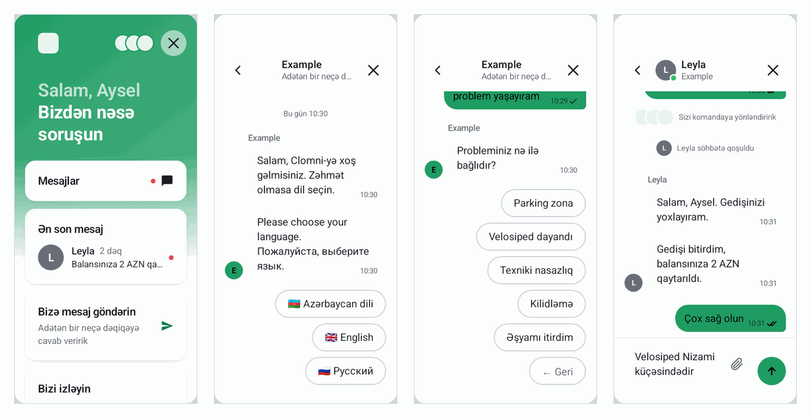

# Clomni Mobile SDK: inteqrasiya təlimatı

Clomni Mobile SDK Clomni Messenger-i iOS və ya Android tətbiqinizin içində açır. İstifadəçiləriniz tətbiqdən
çıxmadan dəstək komandanıza yazır, söhbətlər isə Clomni-də WhatsApp, Instagram və sayt çatı ilə yanaşı
operatorlarınıza düşür.

*Bu təlimatdakı ekran şəkilləri Android SDK-dandır. iOS SDK eyni ekranları çəkir.*

## SDK nə edir

- Messenger-i native ekranlarla açır. WebView yoxdur.
- Clomni flow-larınızı native düymələrlə işlədir: dil seçimi, menyular, formlar, operatora ötürmə.
- Tətbiq bağlı olanda cavabları push bildirişi kimi göstərir.
- Rəngləri, loqonu, mətnləri və xəbərləri Clomni panelindən götürür. Paneldəki dəyişiklik tətbiqə yeni buraxılış
  olmadan çatır.

SDK ekranlarınıza özü heç nə əlavə etmir. Messenger-i öz düymənizdən açırsınız, məsələn profil ekranındakı
"Dəstək" sətrindən. Üzən düymə də var, amma onu özünüz yandırmasanız görünmür.

## Paketlər

| Platforma | Paket | Minimum |
|---|---|---|
| Android | `ai.clomni:messenger:1.0.1` (Maven Central) | Android 6.0 (API 23), Kotlin 1.8 |
| iOS | Swift Package `https://github.com/clomni/clomni-mobile-sdk.git`, versiya 1.0.0, məhsul `ClomniMessenger` | iOS 15, Xcode 15 |
| React Native | `@clomni/react-native` | React Native 0.75 |
| Flutter | `clomni_flutter` | Flutter 3.16, iOS 15, Android API 24 |
| Unity | `https://github.com/clomni/clomni-mobile-sdk.git?path=unity#unity-1.0.1` | Unity 2021.3, iOS 15, Android API 23 |

React Native, Flutter və Unity altda native Android və iOS SDK-larını işlədir. Ona görə bu təlimatdakı hər şey bütün
platformalarda eyni cür işləyir.

SDK `https://app.clomni.ai/v1` ünvanı ilə HTTPS və eyni host üzərində WebSocket vasitəsilə danışır. Şirkət şəbəkəniz
və ya MDM profiliniz yalnız siyahıdakı hostlara icazə verirsə, bu hostu əlavə edin.

## Addımlar

1. **Clomni panelində** "Mobil tətbiq (App SDK)" kanalı yaradın. App ID, hər platforma üçün API açarı və Identity
   Secret alırsınız. Bax: [Clomni paneli](01-panel.md).
2. **Serverinizdə** hər daxil olmuş istifadəçi üçün Identity Secret ilə `user_hash` hesablayın. Bax:
   [İstifadəçinin tanıdılması](02-identity.md).
3. **Tətbiqdə** paketi əlavə edin, açılışda `initialize` çağırın, istifadəçini daxil edin və Messenger-i öz
   düymənizdən açın. Platformanızın bölməsinə baxın:
   [Android](03-android.md), [iOS](04-ios.md), [React Native](05-react-native.md), [Flutter](06-flutter.md),
   [Unity](07-unity.md).
4. **Push bildirişləri**: Firebase və APNs açarlarını panelə yükləyin ([Push açarları](08-push-keys.md)) və cihazın
   tokenini SDK-ya verin (platformanızın bölməsindəki push hissəsi).
5. **Yoxlayın**: paneldə "Test bildirişi" və **Ümumi baxış** bölməsi ilə. Nə isə işləməsə,
   [Problemlərin həlli](09-troubleshooting.md) bölməsinə baxın.

## Açarlar

| Açar | Necə görünür | Harada saxlanır |
|---|---|---|
| App ID | `app_…` | Tətbiqdə |
| Android API açarı | `android_…` | Android tətbiqində |
| iOS API açarı | `ios_…` | iOS tətbiqində |
| Identity Secret | uzun təsadüfi sətir | **Yalnız serverinizdə.** Heç vaxt tətbiqdə yox |

API açarı bir platformaya bağlıdır: iOS açarı Android tətbiqində işləmir. React Native, Flutter və Unity tətbiqləri
hansı platformada işləyirlərsə, onun açarını verirlər.

## Təlimatdakı sözlər

- **Kanal** (paneldə **Gələn qutular** siyahısında, ingiliscə inbox): Clomni-də bir tətbiq. Onun mesajları, açarları və
  ayarları bir yerdədir.
- **Mənbə (source)**: Messenger-i açanda verdiyiniz qısa ad, məsələn `profile_support`. Oradan başlanan söhbətlə
  birlikdə saxlanır və paneldəki statistikada görünür.
- **Flow**: Clomni-nin flow qurucusunda qurulan avtomatik söhbət: düymələr, suallar, operatora ötürmə.
- **Tətbiq hadisəsi**: tətbiqinizin `startFlow` ilə göndərdiyi ad, məsələn `ride_problem`. Həmin hadisəyə bağlı dərc
  olunmuş flow bu mövzuda söhbət başladır.
