# Clomni paneli

Clomni-də hər tətbiq bir "Mobil tətbiq (App SDK)" kanalıdır. Bu bölmədə kanal yaradılır və sonra hər ayarın harada
olduğu göstərilir. Clomni hesabında Administrator rolu lazımdır.

> Bu təlimat paneldə də var: kanal səhifəsi → ayarlar sütunu → **Təlimat**. Bax: [Təlimat](#təlimat).

## Kanalı yaradın

1. **Parametrlər** (sol paneldəki çarx) → **İş sahəsi parametrləri** → **Gələn qutular** → **Gələn qutu əlavə et**.
2. Kanal kataloqu açılır. **Mobil tətbiq (App SDK)** kartını tapın və **Qoşul** düyməsini basın.

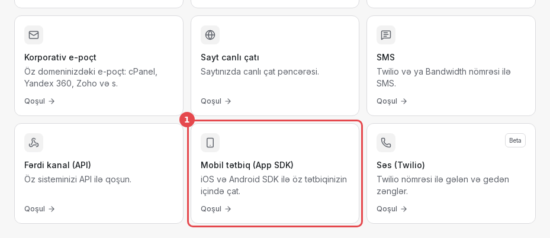

Sehrbazın altı addımı var. Yalnız birincisi məcburidir. Qalanlarını **Sonra et** ilə ötürüb kanal səhifəsində
bitirmək olar.

### 1-ci addım. Tətbiq məlumatı

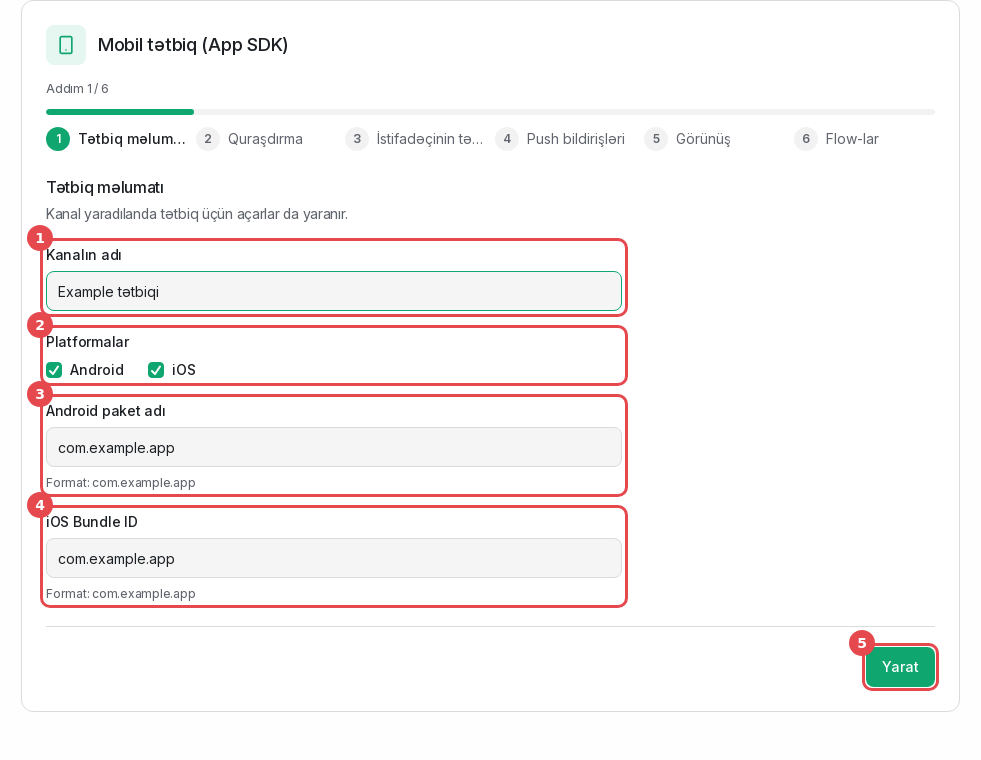

1. **Kanalın adı**: operatorların kanal siyahısında gördüyü ad, məsələn "Example tətbiqi".
2. **Platformalar**: tətbiqinizin işlədiyi platformaları seçin.
3. **Android paket adı**: `app/build.gradle(.kts)` faylındakı `applicationId`, məsələn `com.example.app`.
4. **iOS Bundle ID**: Xcode-da tətbiq hədəfinin Bundle Identifier-i (Signing & Capabilities).
5. **Yarat**. Kanal və onun açarları elə bu an yaranır.

### 2-ci addım. Quraşdırma

Bu addımda **App ID** və hər platformanın **API açarları** görünür, yanında kopyalamaq üçün kod var.

> **API açarlarını indi kopyalayın.** Onlar tam şəkildə yalnız bu addımda görünür. Sonra panel yalnız açarın
> əvvəlini göstərir. Açar itsə, **Quraşdırma** bölməsində yenisini yaradın (aşağıya baxın).

### 3-cü addım. Identity verification

Bu addımda **Identity Secret** görünür. O yalnız bir dəfə göstərilir.

- Onu dərhal serverinizdə saxlayın, məsələn `CLOMNI_IDENTITY_SECRET` mühit dəyişənində.
- Heç vaxt tətbiqə qoymayın.
- Davam etmək üçün "Secret-i təhlükəsiz yerdə saxladım" işarəsini qoyun.
- Rejimi seçin. Hələlik **Tövsiyə olunan** qalsın. Rejimlər [İstifadəçinin tanıdılması](02-identity.md) bölməsində
  izah olunub.

### 4-cü addım. Push bildirişləri

Firebase service account JSON faylını (Android) və APNs `.p8` açarını (iOS) yükləyin, ya da **Sonra et** basın.
Bu faylları necə almaq olar: [Push açarları](08-push-keys.md).

### 5-ci addım. Görünüş

Əsas rəng, loqo, salamlama, tema və üzən düymə. Başlanğıc dəyərlər sayt çatınızdan götürülür. Qalan hər şey **Görünüş**
bölməsindədir.

### 6-cı addım. Flow-lar

İstifadəçi yeni söhbət başlayanda işləyəcək flow-u seçin. O, bu kanala qaralama kimi köçürülür. Onu **Flow-lar**
bölməsində dərc edin, yoxsa Messenger onu işlətmir.

## Kanal səhifəsi

Kanalı sonra **Parametrlər → İş sahəsi parametrləri → Gələn qutular** bölməsindən açın. Kanalın ayarları panelin sol
paneli yanında ayrıca sütundadır. Yuxarıda kanalın adı var, onun sağındakı **←** düyməsi **Gələn qutular** siyahısına
qaytarır. Altında bölmələr üç qrupdadır. SDK üçün lazım olanlar:

| Qrup | Bölmə | Orada nə var |
|---|---|---|
| TƏTBİQ | Ümumi baxış | Kanalın vəziyyəti, xəbərdarlıqlar, son görünən cihazlar |
| | Quraşdırma | App ID, API açarları, hər platforma üçün kod, son cihazlar |
| | Təhlükəsizlik | Identity verification rejimi, Identity Secret, hash yoxlayıcı |
| | Push | Firebase və APNs açarları, bildirişin başlığı, test bildirişi |
| | Təlimat | Bu təlimatın PDF-i və hər platforma üçün paket |
| MESSENGER | Görünüş | Rənglər, loqo, mətnlər, dillər, ana səhifənin kartları, tema |
| | Flow-lar | Bu kanalın flow-ları, nə ilə başladıqlarına görə |
| | Xəbərlər | Messenger-in ana səhifəsindəki xəbərlər |
| | CSAT | Söhbət həll olunanda müştəridən qiymət istəmək: sorğu, göstərmə növü, mesaj |
| | Bot konfiqurasiyası | Tətbiqdən gələn söhbətlərə operatordan əvvəl cavab verən bot (hesabda botlar açıqdırsa) |
| INBOX | Analitika | Aktiv cihazlar, söhbətlər, push-lar, SDK versiyaları |

INBOX qrupunda bütün kanallarda olan ayarlar da var: parametrlər, əməkdaşlar, iş saatları. Şəkillərdə sütunun açıq
bölməsi qırmızı çərçivədədir. Dar ekranda sütun səhifənin yuxarısında açılan siyahı olur.

Flow-lar və Xəbərlər bölmələrində **Tətbiqdə necə görünür?** linki var. O, SDK-nın əsl ekranlarını dialoqda açır:
müştərinin nə gördüyünü orada görürsünüz.

### Ümumi baxış

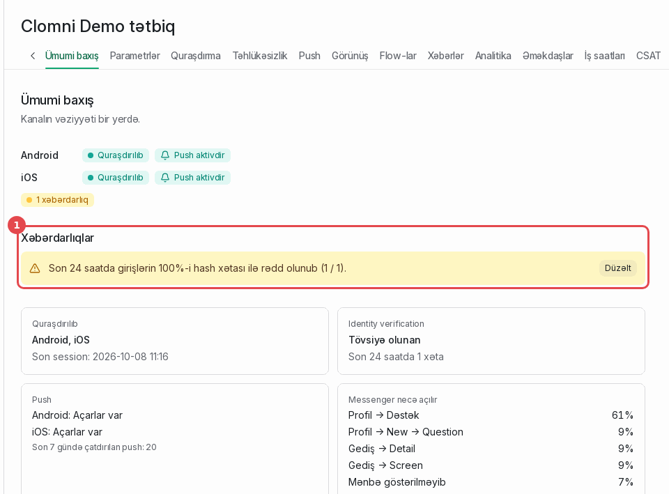

Nə isə işləməyəndə ilk baxılacaq yer. Hər platforma üçün SDK-nın qoşulub-qoşulmadığı və push-un aktiv olub-olmadığı
görünür. Xəbərdarlıqlar (1) problemi adı ilə deyir, məsələn səhv hash səbəbindən rədd olunan girişləri. **Düzəlt**
problemin həll olunduğu bölməni açır.

### Quraşdırma: App ID və API açarları

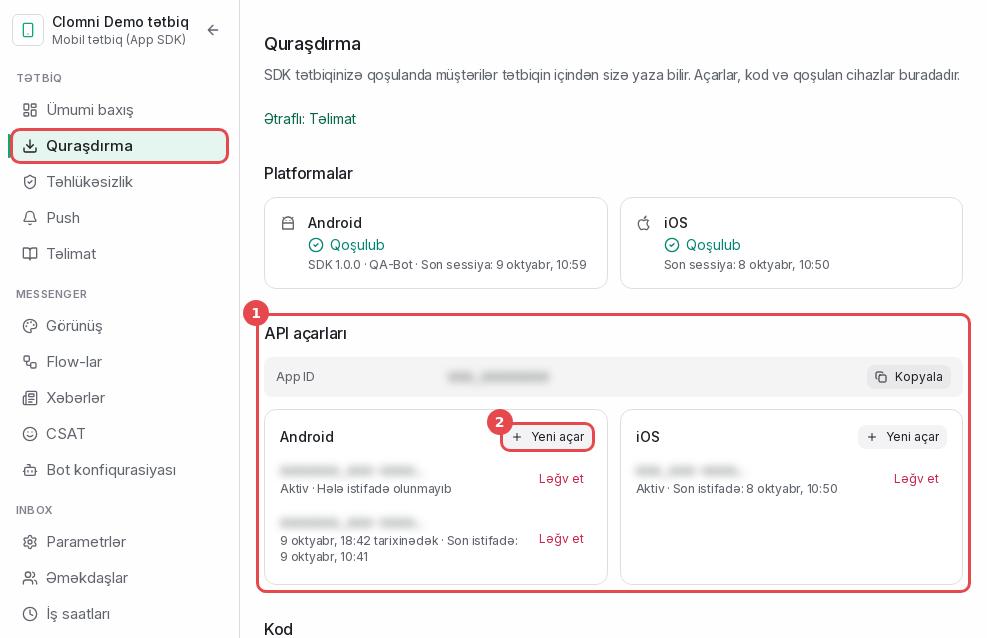

- **API açarları** (1): **Kopyala** düyməsi ilə App ID, sonra hər platformanın açarları. Açarın yalnız əvvəli
  görünür.
- **Yeni açar** (2) həmin platforma üçün yeni açar yaradır və onu bir dəfə tam göstərir.
  - Əvvəlki açar daha **7 gün** işləyir. Ondan sonra köhnə açarı daşıyan tətbiq versiyaları qoşula bilmir.
  - Yeni açarı yalnız köhnəsi sızanda, ya da istifadəçilərin çoxunun quraşdıracağı buraxılışla birlikdə yaradın.
- **Ləğv et** açarı dərhal dayandırır. Sızmış açar üçün işlədin.

Aşağıdakı **Kod** blokunda Android, iOS, React Native və Flutter üçün App ID-niz yazılmış hazır kod var.

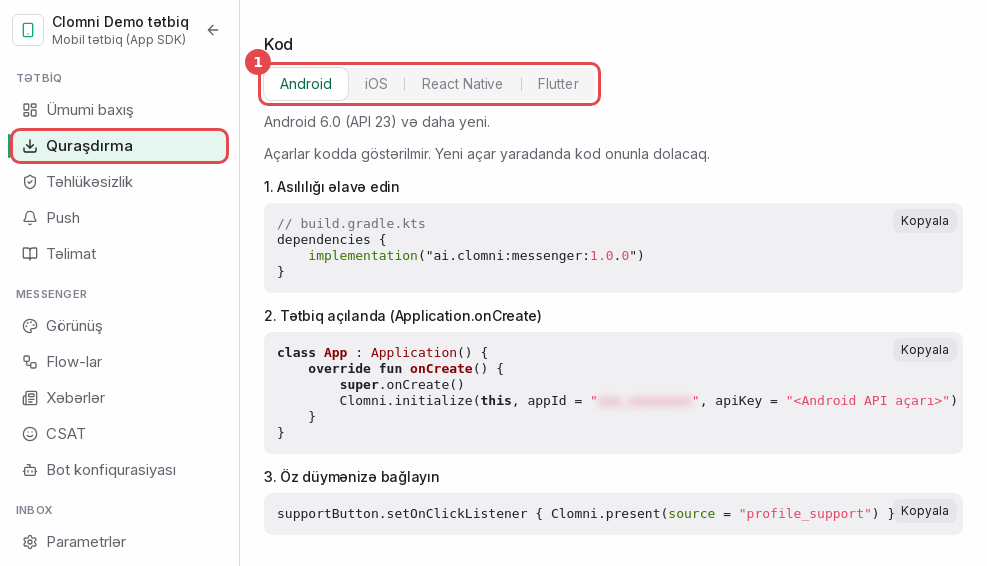

**Son cihazlar** son qoşulan cihazları tətbiq və SDK versiyası ilə göstərir. Tətbiq `initialize` çağırıb sessiya
açandan bir neçə saniyə sonra cihaz burada görünür.

### Təhlükəsizlik

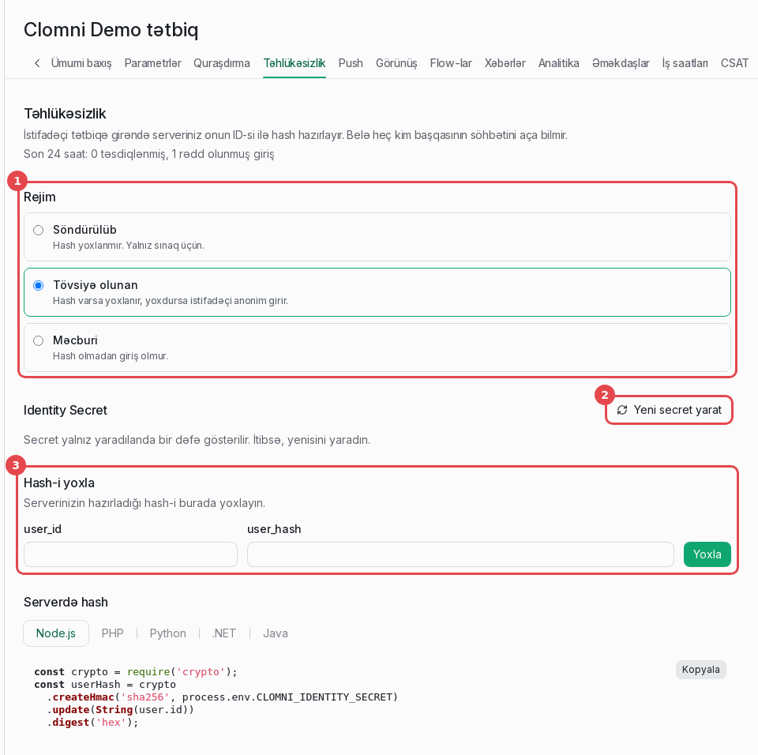

1. **Rejim**: Söndürülüb, Tövsiyə olunan və ya Məcburi. Bax: [İstifadəçinin tanıdılması](02-identity.md#rejimlər).
2. **Yeni secret yarat**: yeni secret bir dəfə göstərilir. Köhnəsi daha 7 gün işləyir, bu müddətdə serverinizi yeni
   secret-ə keçirin.
3. **Hash-i yoxla**: `user_id` və serverinizin hazırladığı `user_hash`-i yazın. Panel onun cari secret-ə, köhnə
   secret-ə uyğun gəldiyini, ya da heç birinə uyğun gəlmədiyini deyir.

### Push

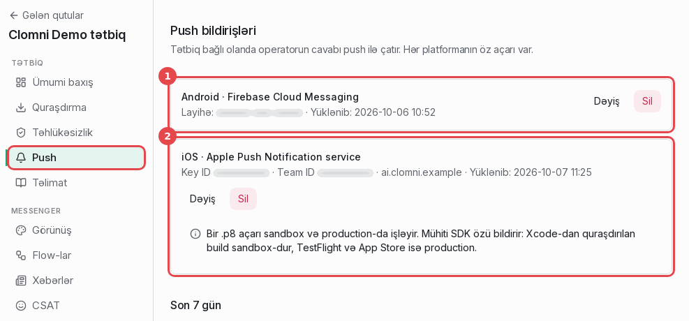

1. **Android · Firebase Cloud Messaging**: Firebase layihəsinin service account JSON faylı.
2. **iOS · Apple Push Notification service**: `.p8` açarı, Key ID, Team ID və Bundle ID ilə birlikdə.

Hər ikisini necə almaq və yükləmək olar: [Push açarları](08-push-keys.md).

Açarların altında:

- **Son 7 gün**: göndərilən, uğursuz, silinmiş token (tətbiq cihazdan silinib) və ötürülən (bu platformanın açarı
  yoxdur) push-lar.
- **Bildirişin başlığı**: bildirişin birinci sətrində nə yazılsın. Standart olaraq "Operator · Brend".
- **Test bildirişi**: aşağıya baxın.

#### Test bildirişi

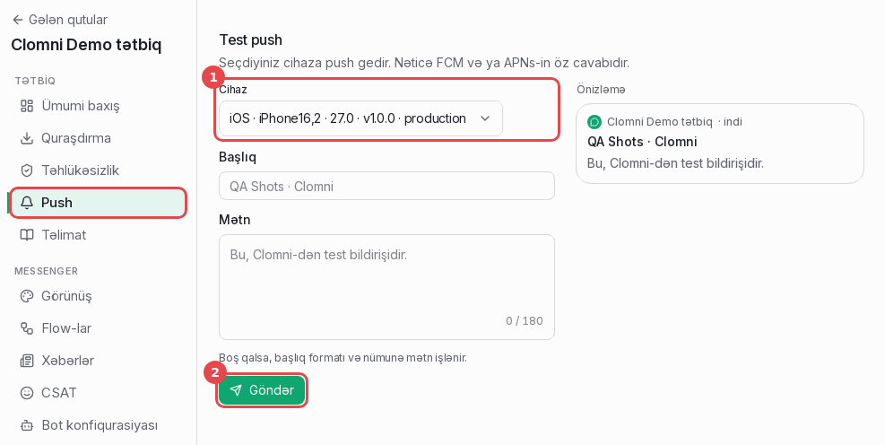

1. **Cihaz**: push tokeni göndərmiş cihazlardan birini seçin. Siyahıda platforma, model, tətbiq versiyası və APNs
   mühiti (sandbox və ya production) yazılır.
2. **Göndər**. Düymənin altındakı cavab FCM və ya APNs-in öz cavabıdır. "Göndərildi" bildirişin cihazda
   görünməli olduğunu deyir.

Tətbiq bildirişlərə icazə verilmiş telefonda `setDeviceToken` çağırana qədər siyahı boşdur.

### Görünüş

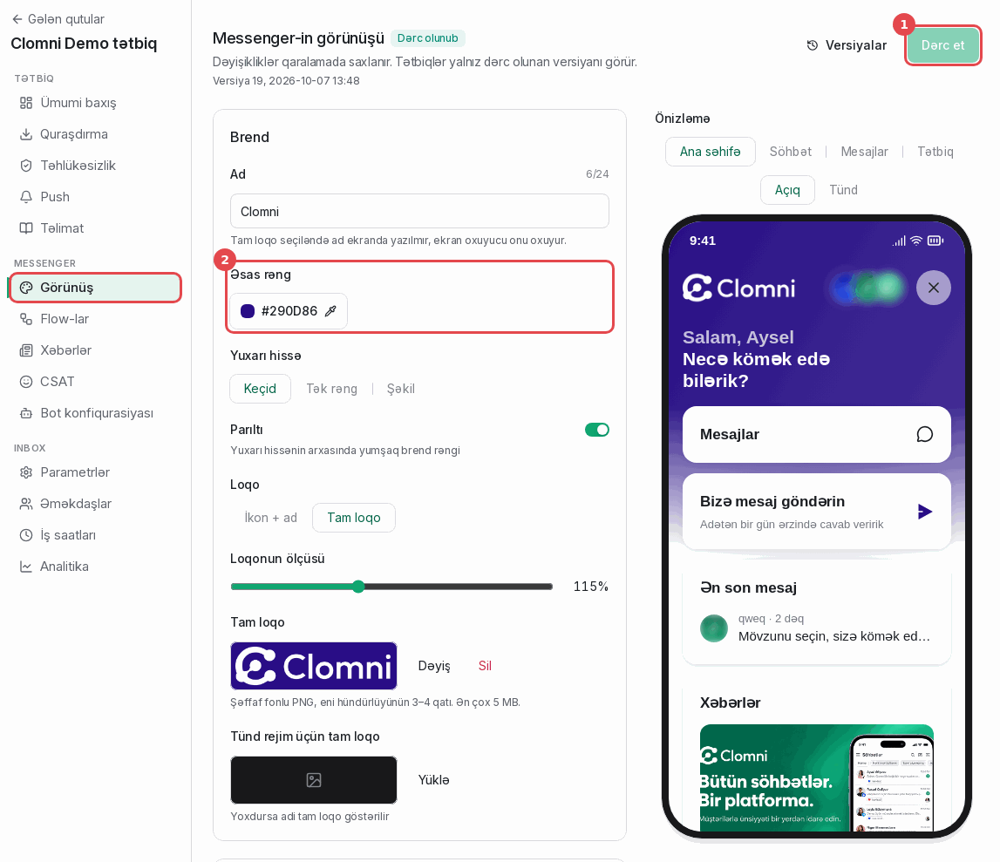

Dəyişikliklər qaralamada saxlanır. Tətbiqlər yalnız dərc olunmuş versiyanı görür.

1. **Dərc et** qaralamanı tətbiqlərə göndərir. Açıq Messenger-lər ekranda yenilənir, tətbiqin yeni buraxılışı
   lazım deyil. Yanındakı **Versiyalar** köhnə versiyanı geri qaytarır.
2. **Əsas rəng** və Brend bölməsinin digər ayarları: ad, yuxarı hissə, loqo. Sağdakı önizləmə hər dəyişikliyi dərhal
   göstərir.

**Dillər** bölməsi Messenger-in hansı dillərdə danışdığını təyin edir. Tətbiq `setLanguage` ilə onlardan birini seçə
bilər. Seçməsə, Messenger telefonun dilinə uyğunlaşır.

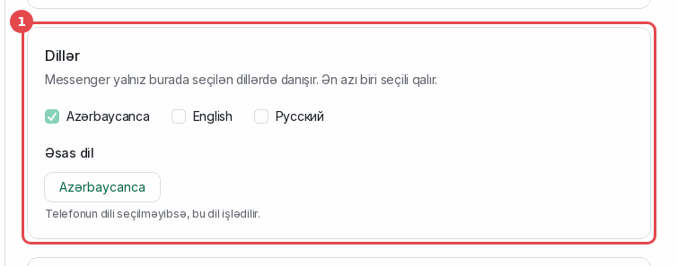

**Tema** bölməsində rejim (1: telefona görə, açıq, tünd), mesaj səsləri və üzən düymə (2) var, düymənin yeri və
aşağıdan məsafəsi ilə birlikdə. Tətbiqin kodda verdiyi dəyər (`setTheme`, `setLauncherVisible`) paneldən üstündür.

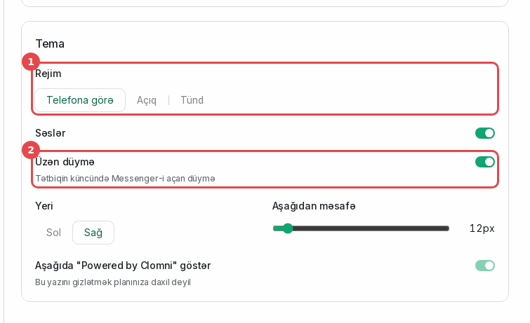

### Flow-lar

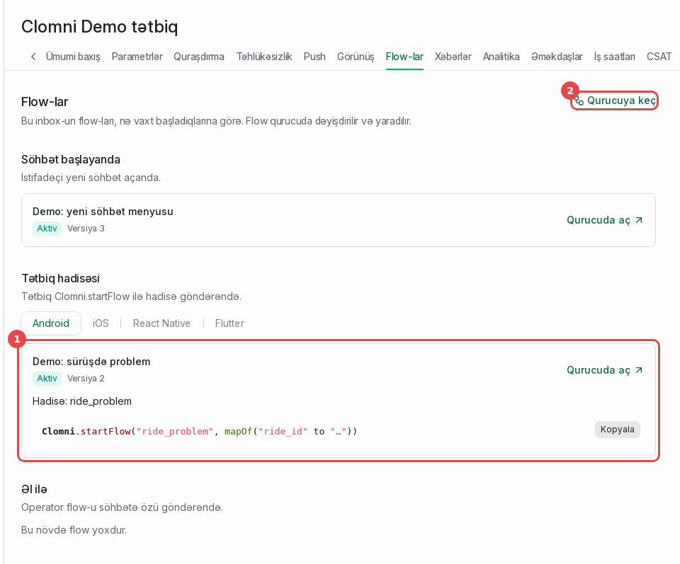

Bu kanalın flow-ları nə ilə başladıqlarına görə qruplanıb:

- **Söhbət başlayanda**: yeni söhbəti qarşılayan flow.
- **Tətbiq hadisəsi** (1): tətbiqdən `startFlow` ilə başlayan flow-lar. Hər birinin yanında hadisənin adı, məsələn
  `Hadisə: ride_problem`, və onu göndərən kod var.
- **Əl ilə**: operatorun söhbətə özü göndərdiyi flow-lar.

**Qurucuya keç** (2) Clomni-nin flow qurucusunu açır. Tətbiq hadisəsi flow-u üçün trigger olaraq "Tətbiq hadisəsi"
seçin, hadisənin adını yazın və flow-u dərc edin.

**Tətbiqdə necə görünür?** (3) seçim düymələrini və formanı SDK-da göründüyü kimi göstərir.

**Hadisənin adı flow-un adı deyil.** `startFlow`-a paneldəki Flow-lar bölməsində flow-un altındakı "Hadisə: …"
sətrindəki adı verin. Flow "Tətbiq hadisəsi" trigger-i ilə qurulmalıdır: "Söhbət başlayanda" trigger-li flow `startFlow`
ilə başlamır.

Flow-da hər seçim bir addıma bağlanmalıdır. Seçimin davamı yoxdursa, müştəri orada ilişib qala bilər. SDK 1.0.2-dən belə
seçimdə flow bitir və müştəri üçün yazı yeri açılır.

### Xəbərlər

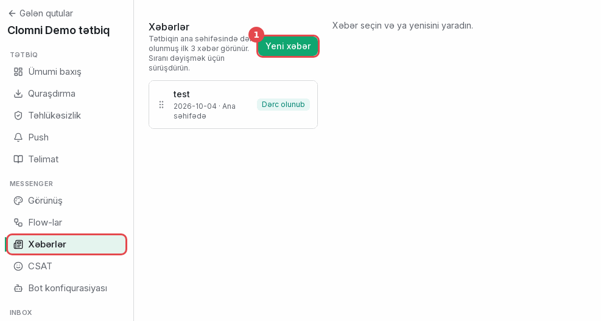

Xəbərlər Messenger-in ana səhifəsində görünür: dərc olunmuş ilk üç xəbər. Sıranı dəyişmək üçün sətri sürüşdürün.

1. **Yeni xəbər** yeni xəbərin redaktorunu açır.
2. **Tətbiqdə necə görünür?** xəbər kartlarını tətbiqin ana səhifəsində göstərir.

Xəbəri dəyişmək üçün onun sətrinə klikləyin. Redaktor ayrıca səhifədə açılır. Başlığın üstündəki **← Xəbərlər**
siyahıya qaytarır.

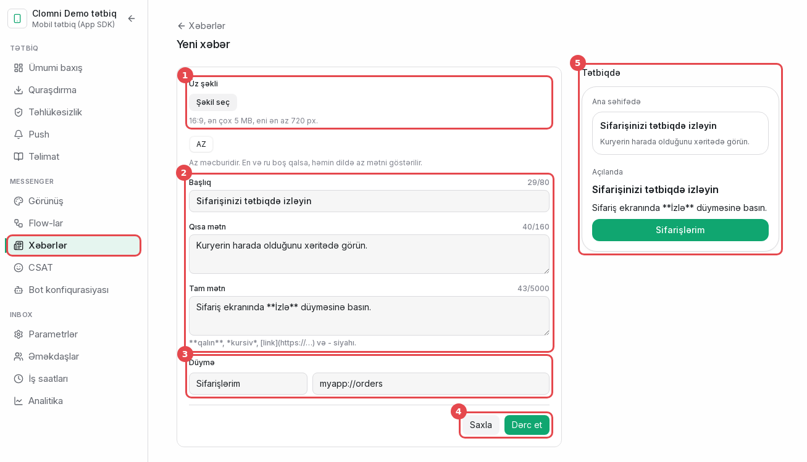

1. **Üz şəkli**: 16:9, ən çox 5 MB, eni ən az 720 px.
2. **Başlıq** və **Qısa mətn** ana səhifədəki kartda görünür, **Tam mətn** xəbər açılanda. Tam mətndə `**qalın**`,
   `*kursiv*`, link və siyahı işlətmək olar. Sahələrin üstündəki dil düymələri redaktə etdiyiniz dili dəyişir.
   Azərbaycanca mətn məcburidir. İngiliscə və ya rusca boş qalsa, Azərbaycanca mətn göstərilir.
3. **Düymə** (istəyə görə): mətni və veb ünvanı və ya tətbiqinizin deep link-i (platformanızın bölməsində
   `onLink`-ə baxın).
4. **Saxla** dəyişiklikləri saxlayır, yeni xəbər qaralama qalır. **Dərc et** xəbəri saxlayıb tətbiqlərə göndərir.
   Dərc olunmuş xəbərdə bu düymə **Geri çək** olur.
5. **Tətbiqdə**: ana səhifədəki kart və açılmış xəbər, müştərinin gördüyü kimi. Hər dəyişikliyə uyğun yenilənir.

### Təlimat

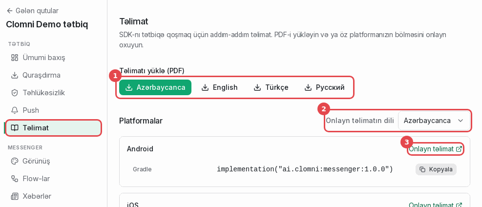

Bu təlimat paneldə də var.

1. Təlimatın PDF-i dörd dildə: Azərbaycanca, ingiliscə, türkcə və rusca. Panelin dili birinci gəlir.
2. **Onlayn təlimatın dili**: aşağıdakı linklər təlimatın bu dildəki bölmələrini açır.
3. **Onlayn təlimat** platformanızın bölməsini açır. Kartda paketin quraşdırma əmri var, **Kopyala** ilə götürün.
