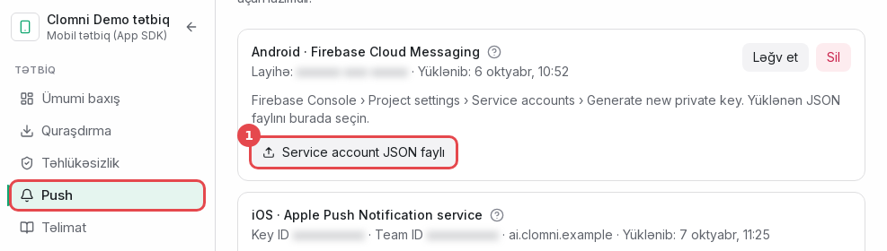
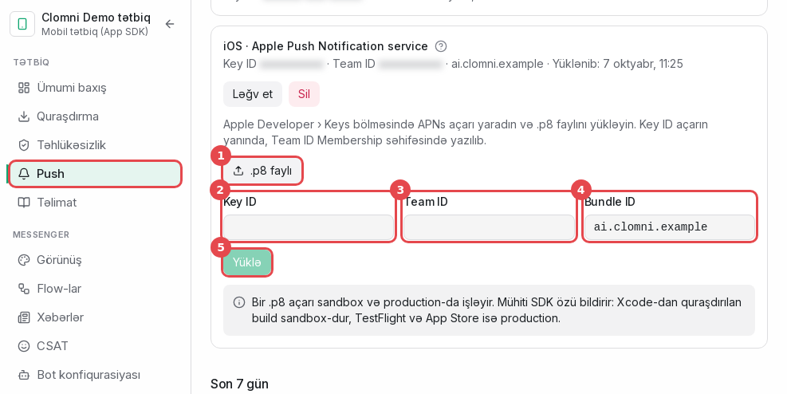

# Push açarları

Clomni push bildirişlərini sizin öz açarlarınızla göndərir: Android üçün Firebase service account, iOS üçün APNs
açarı. Hər ikisi kanal səhifəsində, ayarlar sütununun **Push** bölməsində (və ya sehrbazın 4-cü addımında) yüklənir.

| Platforma | Panelə nə lazımdır | Haradan gəlir |
|---|---|---|
| Android | Service account JSON | Firebase console → Project settings → Service accounts |
| iOS | `.p8` açarı, Key ID, Team ID, Bundle ID | Apple Developer → Certificates, Identifiers & Profiles → Keys |

## Android: Firebase service account JSON

> Panelə `google-services.json` yox, **service account JSON** lazımdır. `google-services.json` tətbiqə qoyulur və
> yalnız layihənin adını deyir. Service account JSON isə Clomni serverinə layihəniz üzərindən mesaj göndərməyə imkan
> verən gizli açardır.

1. [Firebase console](https://console.firebase.google.com)-u açın və tətbiqinizin `google-services.json`-unun aid
   olduğu layihəni seçin. Push yalnız hər iki fayl eyni layihədən olanda işləyir.
2. "Project Overview"-un yanındakı çarx → **Project settings** → **Service accounts** tabı.
3. "Firebase Admin SDK" altında **Generate new private key**, sonra **Generate key** basın. JSON faylı yüklənir.

   > **Yol:** `Firebase console → ⚙ Project settings → Service accounts → Firebase Admin SDK → Generate new private key → Generate key`
   >
   > Sənəd: [firebase.google.com/docs/admin/setup](https://firebase.google.com/docs/admin/setup#initialize-sdk-non-google)

4. Clomni panelində: kanal → **Push** → "Android · Firebase Cloud Messaging" → **Service account JSON faylı** (1) və
   yüklənən faylı seçin. Sonra kartda layihənin adı və yüklənmə tarixi görünür.

   

Faylı parol kimi saxlayın: repozitoriyaya commit etməyin, e-poçtla göndərməyin. Sızsa, açarı Google Cloud Console-da
silin (IAM → Service accounts → Keys) və yenisini yükləyin.

Firebase Cloud Messaging API (V1) yeni Firebase layihələrində standart olaraq açıqdır. Söndürülübsə, Test bildirişi
FCM-dən xəta qaytarır. API-ni Google Cloud Console → APIs & Services bölməsində yandırın.

## iOS: APNs açarı

Apple Developer Program-da Account Holder və ya Admin rolu lazımdır.

### 1. Açarı yaradın

1. [developer.apple.com/account](https://developer.apple.com/account) → **Certificates, Identifiers & Profiles** →
   **Keys** → **+**.

   > **Yol:** `developer.apple.com/account → Certificates, Identifiers & Profiles → Keys → +`
   >
   > **+** düyməsi **Keys** başlığının yanındadır.
   >
   > Sənəd: [developer.apple.com/help/account/keys/create-a-private-key](https://developer.apple.com/help/account/keys/create-a-private-key/)

2. Açara ad verin, **Apple Push Notifications service (APNs)** işarəsini qoyun və **Configure** basın.
3. **Environment: Sandbox & Production.** Bu seçim vacibdir:
   - Yalnız Sandbox açarı Xcode-dan işə salınan build-lərdə işləyir, TestFlight və App Store-da işləmir.
   - Yalnız Production açarı TestFlight və App Store-da işləyir, Xcode-dan işə salınan build-lərdə işləmir.
   - Hər iki halda APNs `BadEnvironmentKeyInToken` cavabı verir və push çatmır.

   Key restriction üçün **Team Scoped (All Topics)** bir açarın komandanızın bütün tətbiqlərinə xidmət etməsinə
   imkan verir.

   > **Yol:** `Keys → + → Key Name → Apple Push Notifications service (APNs) → Configure`
   >
   > Seçin: **Environment: Sandbox & Production**, **Key Restriction: Team Scoped (All Topics)**. Sonra **Save**.
   >
   > Sənəd: [developer.apple.com/help/account/keys/create-a-private-key](https://developer.apple.com/help/account/keys/create-a-private-key/)

4. **Save** → **Continue** → **Register**.

Apple mühit seçimini əlavə etməzdən əvvəl yaradılan açarlar hər iki mühitdə işləyir. Komandanızda belə açar, ya da
Sandbox & Production açarı artıq varsa, onu Clomni üçün də işlədə bilərsiniz.

### 2. Yükləyin və ID-ləri qeyd edin

1. Açarın səhifəsində **Download** basın. `.p8` faylını **yalnız bir dəfə** yükləmək olur. Onu etibarlı yerdə
   saxlayın, itsə yeni açar yaradın.
2. Həmin səhifədəki **Key ID**-ni qeyd edin (10 simvol).

   > **Yol:** `Certificates, Identifiers & Profiles → Keys → açarınız → Download`
   >
   > **Key ID** açarın adının altında görünür. **Download** düyməsi səhifənin yuxarı sağ küncündədir.
   >
   > Sənəd: [developer.apple.com/help/account/keys/get-a-key-identifier](https://developer.apple.com/help/account/keys/get-a-key-identifier/), [developer.apple.com/help/account/keys/revoke-edit-and-download-keys](https://developer.apple.com/help/account/keys/revoke-edit-and-download-keys/)

3. **Team ID**-ni tapın: Apple Developer → **Membership details** (10 simvol).

   > **Yol:** `developer.apple.com/account → Membership details → Team ID`
   >
   > Sənəd: [developer.apple.com/help/account/basics/account-landing-page](https://developer.apple.com/help/account/basics/account-landing-page/)

4. **Bundle ID** tətbiqinizin Bundle Identifier-idir (Xcode → hədəf → Signing & Capabilities), məsələn
   `com.example.app`.

### 3. Clomni-yə yükləyin

Kanal → **Push** → "iOS · Apple Push Notification service":

1. **.p8 faylı**: yüklənən `AuthKey_XXXXXXXXXX.p8` faylını seçin.
2. **Key ID**.
3. **Team ID**.
4. **Bundle ID**.
5. **Yüklə**.

Panel formatları yoxlayır (Key ID və Team ID 10 hərf və ya rəqəmdir). Apple-ın açarı qəbul edib-etmədiyi ilk push-da
bilinir: Test bildirişi göndərin.

## Test bildirişi

Tətbiq bildirişlərə icazə verilmiş telefonda işləyib tokenini verəndən sonra cihaz **Push** bölməsindəki
**Test bildirişi** siyahısında görünür. Onu seçin və **Göndər** basın. Cavab FCM və ya APNs-in öz cavabıdır.

| Cavab | Mənası | Nə etməli |
|---|---|---|
| Göndərildi | Bildiriş yoldadır | Heç nə görünmürsə, tətbiqin push kodunu yoxlayın |
| `BadEnvironmentKeyInToken` (APNs) | Açar o biri mühitlə məhdudlaşıb | Sandbox & Production açarı yaradın |
| `InvalidProviderToken` (APNs) | Key ID və ya Team ID səhvdir, ya da açar ləğv olunub | Hər iki ID-ni yoxlayın, açarı yenidən yükləyin |
| `DeviceTokenNotForTopic` (APNs) | Bundle ID tətbiqə uyğun deyil | Tətbiqin Bundle ID-sini yazın |
| `BadDeviceToken` (APNs) | Token başqa tətbiqindir və ya artıq etibarlı deyil | Tətbiqi yenidən quraşdırın, açın, bildirişlərə icazə verin |
| `SENDER_ID_MISMATCH` (FCM) | Service account `google-services.json`-dakından başqa Firebase layihəsinindir | Tətbiqin layihəsinin service account-unu yükləyin |
| `UNREGISTERED` (FCM) | Tətbiq cihazdan silinib və ya tokenin vaxtı keçib | Tətbiqi yenidən açın ki, yeni token göndərsin |
| Göndərilmədi: açar yoxdur | Bu platforma üçün açar yüklənməyib | Açarı yükləyin |

APNs və ya FCM-in ölü saydığı tokeni Clomni silir. **Push** bölməsindəki "Silinmiş token" sütunu onları sayır.
