# The Clomni panel

Every app is one "Mobile app (App SDK)" inbox in Clomni. This chapter creates the inbox and shows where each setting
lives afterwards. You need the Administrator role in the Clomni account.

> This guide is also in the panel: the inbox page → side menu → **Guide**. See [Guide](#guide).

## Create the inbox

1. Open **Settings** (the gear in the left rail) → **Workspace settings** → **Inboxes** → **Add Inbox**.
2. The channel catalog opens. Find **Mobile app (App SDK)** and press **Connect**.

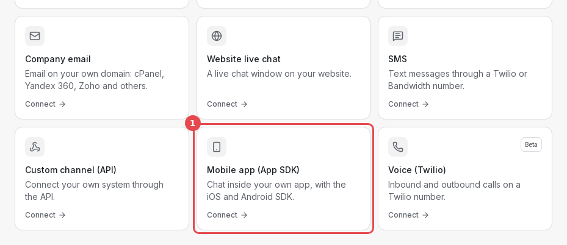

The wizard has six steps. Only the first one is required; the others can be left with **Do it later** and finished
on the inbox page.

### Step 1. App details

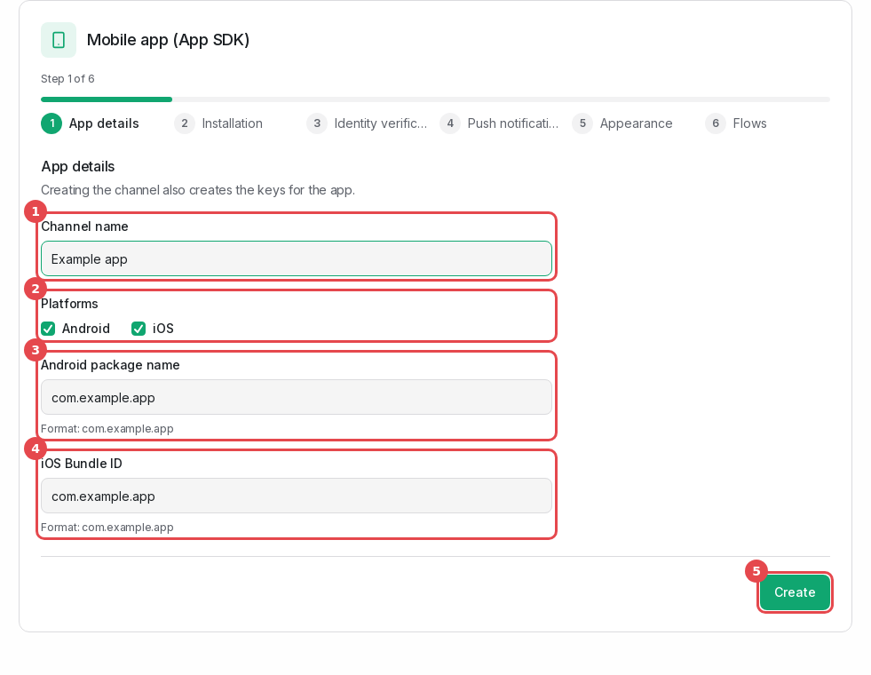

1. **Channel name**: what your agents see in the inbox list, for example "Example app".
2. **Platforms**: tick the platforms your app runs on.
3. **Android package name**: the `applicationId` from `app/build.gradle(.kts)`, for example `com.example.app`.
4. **iOS Bundle ID**: the Bundle Identifier of the app target in Xcode (Signing & Capabilities).
5. **Create**. The inbox and its keys are made now.

### Step 2. Installation

This step shows the **App ID** and the **API keys** of each platform, with code to copy.

> **Copy the API keys now.** They are shown in full only in this step. Later the panel shows only their beginning.
> If a key is lost, make a new one under **Installation** (see below).

### Step 3. Identity verification

This step shows the **Identity Secret**. It is shown only once.

- Store it on your server right away, for example as the environment variable `CLOMNI_IDENTITY_SECRET`.
- Never put it into the app.
- Tick "I have stored the secret safely" to continue.
- Choose the mode. Keep **Recommended** for now. The modes are explained in [Identifying users](02-identity.md).

### Step 4. Push notifications

Upload the Firebase service account JSON (Android) and the APNs `.p8` key (iOS), or press **Do it later**. How to
get these files: [Push keys](08-push-keys.md).

### Step 5. Appearance

The main colour, the logo, the greeting, the theme and the floating button. The starting values come from your
website chat. Everything else is under **Appearance**.

### Step 6. Flows

Choose the flow that runs when a user starts a new conversation. It is copied to this inbox as a draft. Publish it under
**Flows**, otherwise the Messenger does not run it.

## The inbox page

Open the inbox later from **Settings → Workspace settings → Inboxes**. The inbox's settings are in their own column
next to the panel's sidebar: **← Inboxes** and the inbox name at the top, then the sections in three groups. The
ones you need for the SDK:

| Group | Section | What is there |
|---|---|---|
| APP | Overview | The state of the channel, warnings, devices seen last |
| | Installation | App ID, API keys, code for each platform, recent devices |
| | Security | Identity verification mode, Identity Secret, hash tester |
| | Push | Firebase and APNs keys, notification title, test push |
| | Guide | This guide as a PDF, and the package for each platform |
| MESSENGER | Appearance | Colours, logo, texts, languages, Home cards, theme |
| | Flows | The flows of this inbox, by what starts them |
| | News | News items on the Messenger's Home screen |
| INBOX | Analytics | Active devices, conversations, pushes, SDK versions |

The INBOX group also has the settings every inbox has: settings, collaborators, business hours. In the screenshots
the open section of the menu has a red frame. On a narrow screen the menu becomes a dropdown above the page.

### Overview

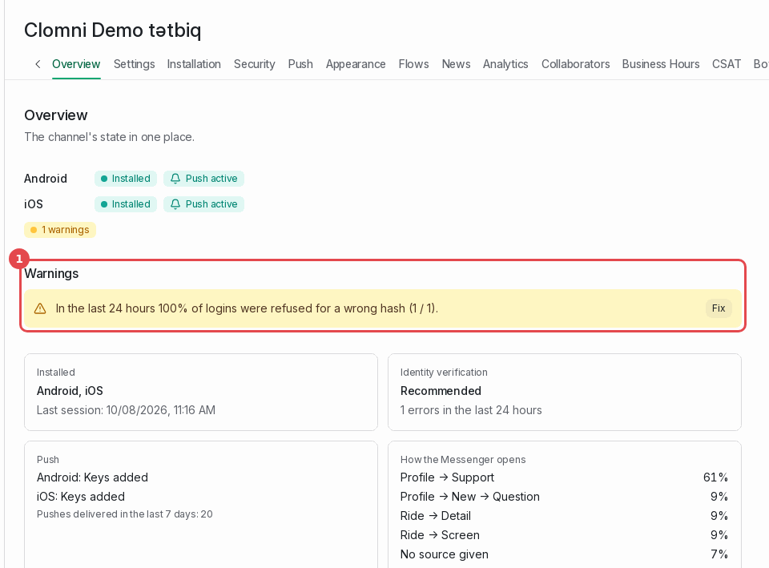

The first place to look when something does not work. Each platform shows whether the SDK has connected and whether
push is active. Warnings (1) name the problem, for example logins refused because of a wrong hash, and **Fix** opens
the section where it is solved.

### Installation: App ID and API keys

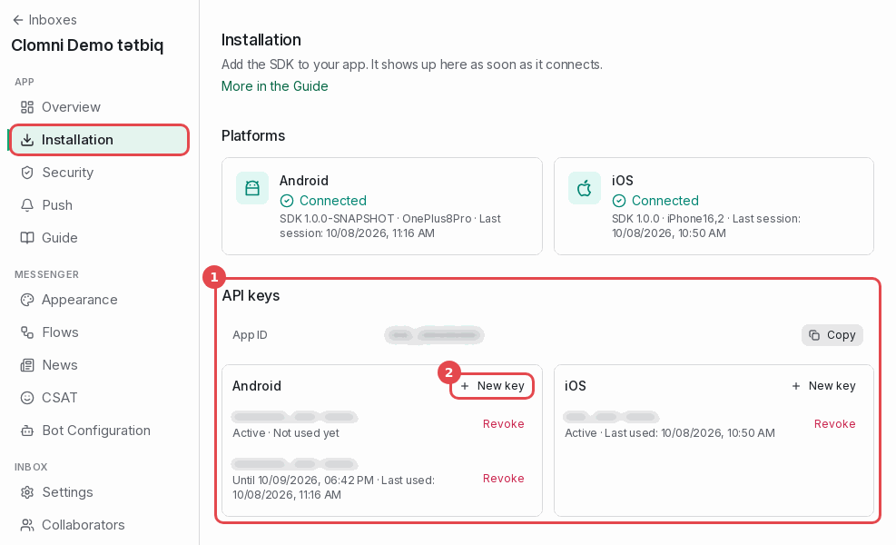

- **API keys** (1): the App ID with a **Copy** button, then the keys of each platform. Only the beginning of a key is
  shown.
- **New key** (2) makes a new key for that platform and shows it in full once.
  - The previous key keeps working for **7 days**. App versions that still carry it stop connecting after that.
  - Make a new key only when the old one has leaked, or together with a release most of your users will install.
- **Revoke** stops a key at once. Use it for a key that has leaked.

Further down, the **Code** block has ready-made code for Android, iOS, React Native and Flutter with your App ID
filled in.

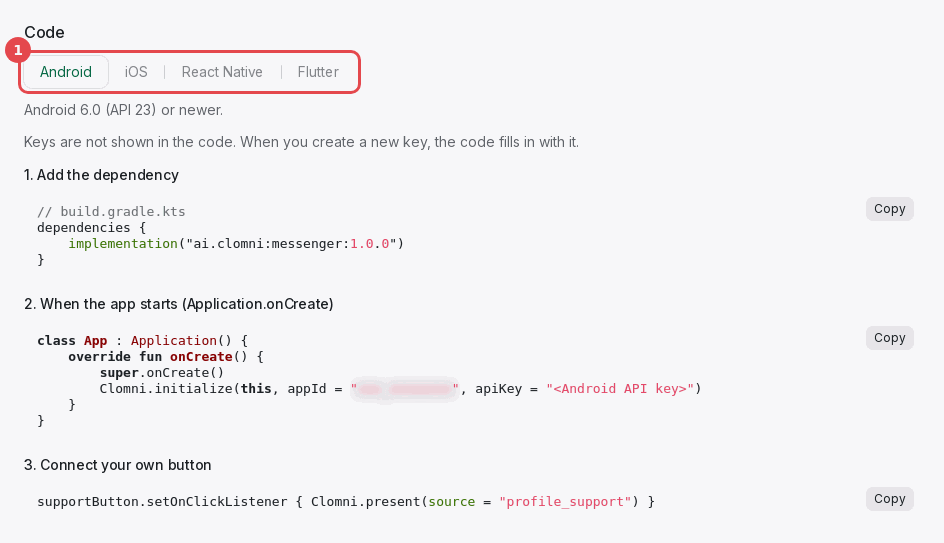

**Recent devices** lists the devices that connected last, with the app version and the SDK version. A device appears
here a few seconds after the app calls `initialize` and opens a session.

### Security

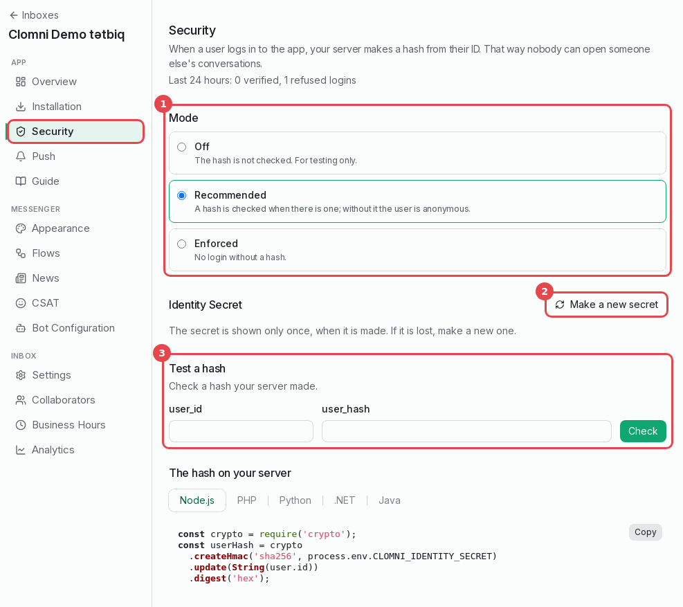

1. **Mode**: Off, Recommended or Enforced. See [Identifying users](02-identity.md#modes).
2. **Make a new secret**: the new secret is shown once. The old one keeps working for 7 days, so move your server
   to the new secret within that time.
3. **Test a hash**: enter a `user_id` and the `user_hash` your server made. The panel says whether it matches the
   current secret, the old one, or neither.

### Push

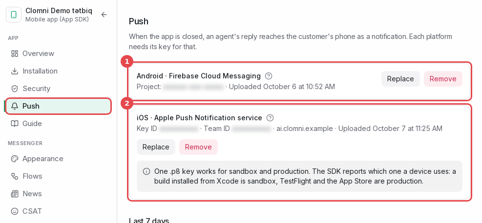

1. **Android · Firebase Cloud Messaging**: the Firebase project's service account JSON.
2. **iOS · Apple Push Notification service**: the `.p8` key with its Key ID, Team ID and Bundle ID.

How to get and upload both: [Push keys](08-push-keys.md).

Below the keys:

- **Last 7 days**: pushes sent, failed, tokens removed (the app was deleted from the device) and skipped (no key
  for that platform).
- **Notification title**: what the first line of a notification says. "Agent · Brand" by default.
- **Test push**: see below.

#### Test push

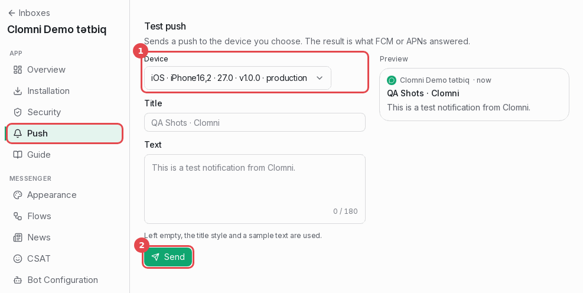

1. **Device**: choose one of the devices that sent a push token. The list says the platform, the model, the app
   version and the APNs environment (sandbox or production).
2. **Send**. The answer under the button is what FCM or APNs replied. "Sent" means the notification should appear on
   the device.

The list is empty until the app has called `setDeviceToken` on a phone where notifications are allowed.

### Appearance

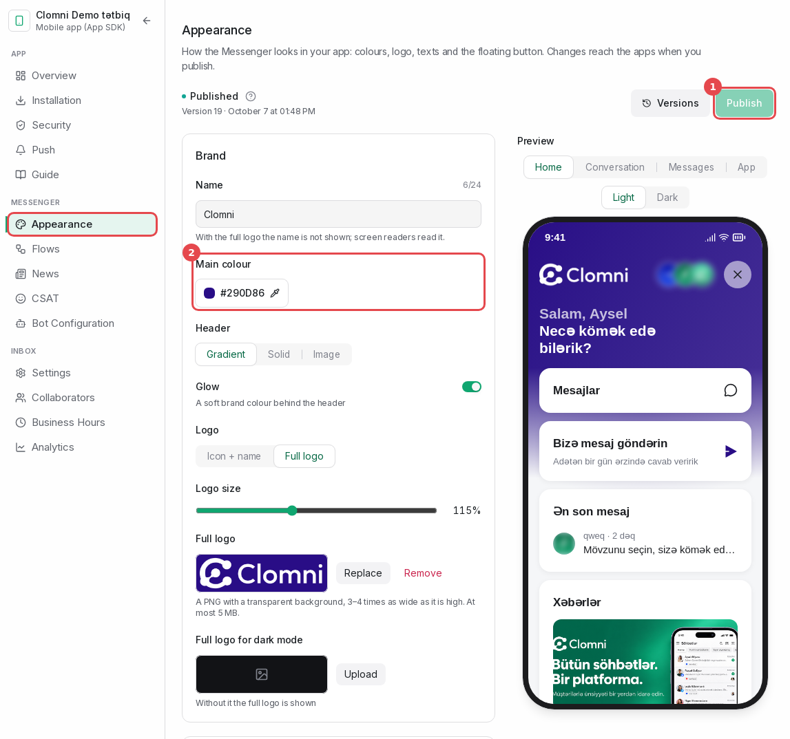

Changes are kept in a draft. Apps see only the published version.

1. **Publish** sends the draft to the apps. Open Messengers update on screen; there is no app release involved.
   **Versions** next to it brings an older version back.
2. **Main colour** and the other Brand settings: name, header, logo. The preview on the right follows each change.

The **Languages** section decides which languages the Messenger speaks. The app can pick one of them with
`setLanguage`; without it the Messenger follows the phone's language.

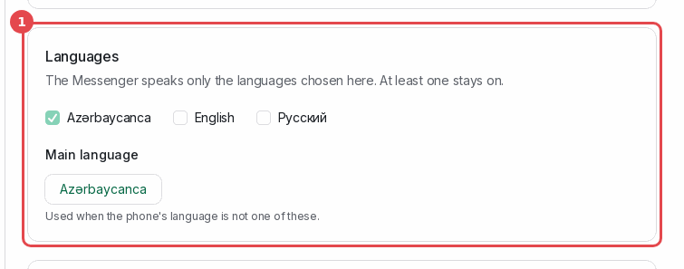

The **Theme** section has the mode (1: follow the phone, light, dark), the message sounds and the floating button (2)
with its position and distance from the bottom. A value the app sets in code (`setTheme`, `setLauncherVisible`) wins
over the panel.

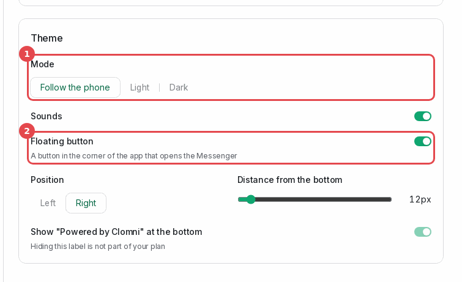

### Flows

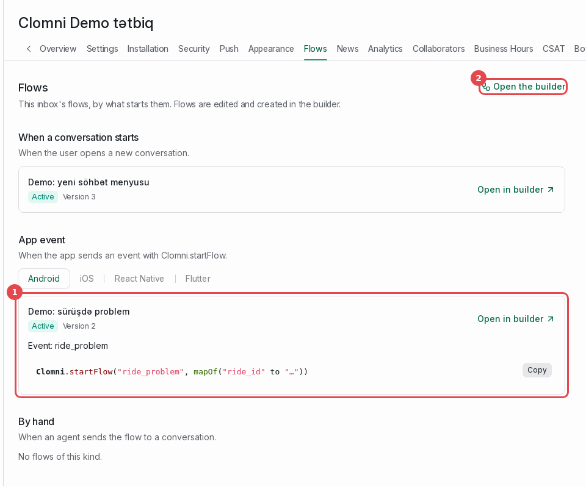

The flows of this inbox, grouped by what starts them:

- **When a conversation starts**: the flow that greets a new conversation.
- **App event** (1): flows started by `startFlow` from the app. Each shows its event name, for example
  `Event: ride_problem`, and the code that sends it.
- **By hand**: flows an agent sends into a conversation.

**Open the builder** (2) opens Clomni's flow builder. To make an app event flow, choose "App event" as the trigger,
enter the event name and publish the flow.

### News

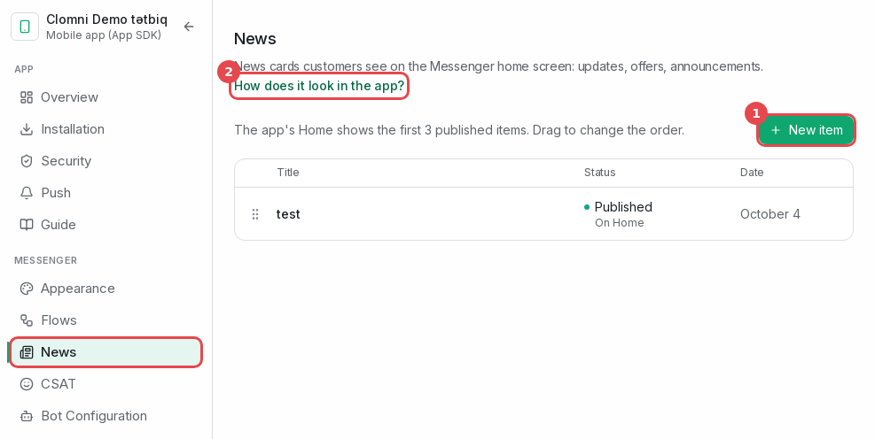

News items appear on the Messenger's Home screen: the first three published items. **New item** (1) creates one with
a cover image, a title, a short text, a full text and an optional button. The button can open a web address or a
deep link of your app (see `onLink` in your platform's chapter).

### Guide

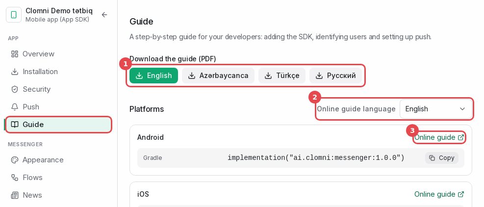

This guide is also in the panel.

1. The guide as a PDF in four languages: Azerbaijani, English, Turkish and Russian. The panel's language comes first.
2. **Online guide language**: the links below open the guide's chapters in this language.
3. **Online guide** opens your platform's chapter. The card has the package's install command; take it with **Copy**.
