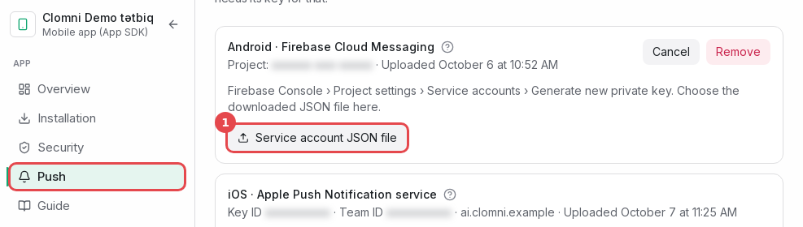
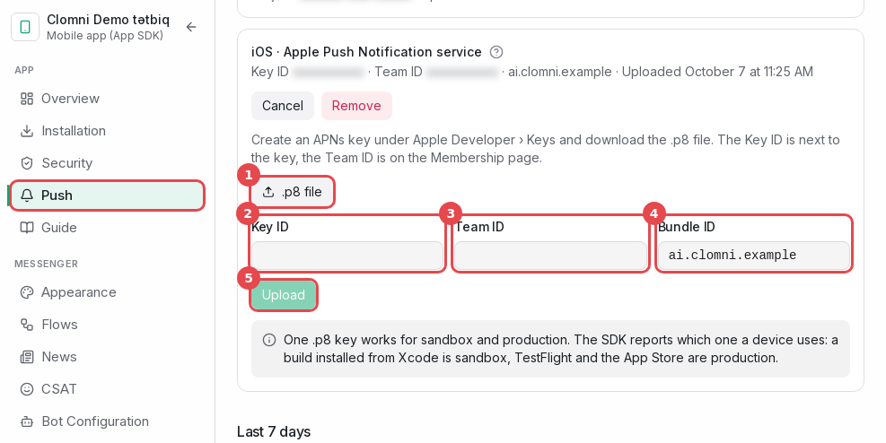

# Push keys

Clomni sends push notifications with your own keys: a Firebase service account for Android and an APNs key for
iOS. Both are uploaded under **Push** in the inbox's settings column (or in step 4 of the wizard).

| Platform | What the panel needs | Where it comes from |
|---|---|---|
| Android | Service account JSON | Firebase console → Project settings → Service accounts |
| iOS | `.p8` key, Key ID, Team ID, Bundle ID | Apple Developer → Certificates, Identifiers & Profiles → Keys |

## Android: the Firebase service account JSON

> The panel needs the **service account JSON**, not `google-services.json`. `google-services.json` goes into the app
> and only names the project. The service account JSON is a private key that lets Clomni's server send messages
> through your project.

1. Open the [Firebase console](https://console.firebase.google.com) and choose the project your app's
   `google-services.json` belongs to. Push only works when both files come from the same project.
2. Click the gear next to "Project Overview" → **Project settings** → the **Service accounts** tab.
3. Under "Firebase Admin SDK" press **Generate new private key**, then **Generate key**. A JSON file downloads.

   > **Path:** `Firebase console → ⚙ Project settings → Service accounts → Firebase Admin SDK → Generate new private key → Generate key`
   >
   > Docs: [firebase.google.com/docs/admin/setup](https://firebase.google.com/docs/admin/setup#initialize-sdk-non-google)

4. In the Clomni panel: the inbox → **Push** → "Android · Firebase Cloud Messaging" → **Service account JSON file**
   (1), and choose the downloaded file. The card then shows the project's name and the upload date.

   

Keep the file as you would keep a password: do not commit it and do not send it by e-mail. If it leaks, delete the
key in Google Cloud Console (IAM → Service accounts → Keys) and upload a new one.

The Firebase Cloud Messaging API (V1) is on by default in new Firebase projects. If it was turned off, Test push
reports an error from FCM; turn the API on in Google Cloud Console → APIs & Services.

## iOS: the APNs key

You need the Account Holder or Admin role in the Apple Developer Program.

### 1. Create the key

1. Open [developer.apple.com/account](https://developer.apple.com/account) → **Certificates, Identifiers &
   Profiles** → **Keys** → **+**.

   > **Path:** `developer.apple.com/account → Certificates, Identifiers & Profiles → Keys → +`
   >
   > The **+** button is next to the **Keys** heading.
   >
   > Docs: [developer.apple.com/help/account/keys/create-a-private-key](https://developer.apple.com/help/account/keys/create-a-private-key/)

2. Give the key a name, tick **Apple Push Notifications service (APNs)** and press **Configure**.
3. **Environment: Sandbox & Production.** This choice matters:
   - A Sandbox-only key works for builds run from Xcode but fails for TestFlight and the App Store.
   - A Production-only key works for TestFlight and the App Store but fails for builds run from Xcode.
   - Either way APNs answers `BadEnvironmentKeyInToken`, and no push arrives.

   For key restriction, **Team Scoped (All Topics)** lets one key serve every app of your team.

   > **Path:** `Keys → + → Key Name → Apple Push Notifications service (APNs) → Configure`
   >
   > Choose **Environment: Sandbox & Production** and **Key Restriction: Team Scoped (All Topics)**, then **Save**.
   >
   > Docs: [developer.apple.com/help/account/keys/create-a-private-key](https://developer.apple.com/help/account/keys/create-a-private-key/)

4. **Save** → **Continue** → **Register**.

Keys made before Apple added the environment choice work in both environments. If your team already has such a key,
or a Sandbox & Production one, you can use it for Clomni too.

### 2. Download it, and note the IDs

1. On the key's page press **Download**. The `.p8` file can be downloaded **only once**. Keep it safe; if it is
   lost, make a new key.
2. Note the **Key ID** shown on the same page (10 characters).

   > **Path:** `Certificates, Identifiers & Profiles → Keys → your key → Download`
   >
   > The **Key ID** is shown below the key's name. **Download** is at the top right of the page.
   >
   > Docs: [developer.apple.com/help/account/keys/get-a-key-identifier](https://developer.apple.com/help/account/keys/get-a-key-identifier/), [developer.apple.com/help/account/keys/revoke-edit-and-download-keys](https://developer.apple.com/help/account/keys/revoke-edit-and-download-keys/)

3. Find the **Team ID**: Apple Developer → **Membership details** (10 characters).

   > **Path:** `developer.apple.com/account → Membership details → Team ID`
   >
   > Docs: [developer.apple.com/help/account/basics/account-landing-page](https://developer.apple.com/help/account/basics/account-landing-page/)

4. The **Bundle ID** is your app's Bundle Identifier (Xcode → target → Signing & Capabilities), for example
   `com.example.app`.

### 3. Upload it to Clomni

The inbox → **Push** → "iOS · Apple Push Notification service":

1. **.p8 file**: choose the downloaded `AuthKey_XXXXXXXXXX.p8`.
2. **Key ID**.
3. **Team ID**.
4. **Bundle ID**.
5. **Upload**.

The panel checks the formats (Key ID and Team ID are 10 letters or digits). Whether Apple accepts the key shows with
the first push: use Test push.

## Test push

Once the app runs on a phone with notifications allowed and has handed over its token, the device appears in the
**Test push** list under **Push**. Choose it and press **Send**. The answer is FCM's or APNs' own.

| Answer | Meaning | What to do |
|---|---|---|
| Sent | The notification is on its way | If nothing appears, check the app's push code |
| `BadEnvironmentKeyInToken` (APNs) | The key is limited to the other environment | Make a Sandbox & Production key |
| `InvalidProviderToken` (APNs) | Wrong Key ID or Team ID, or the key was revoked | Check both IDs; upload the key again |
| `DeviceTokenNotForTopic` (APNs) | The Bundle ID does not match the app | Enter the app's Bundle ID |
| `BadDeviceToken` (APNs) | The token is of another app or no longer valid | Reinstall the app, open it, allow notifications |
| `SENDER_ID_MISMATCH` (FCM) | The service account is of another Firebase project than `google-services.json` | Upload the service account of the app's project |
| `UNREGISTERED` (FCM) | The app was removed from the device or the token expired | Open the app again so it sends a new token |
| Not sent: no key | No key is uploaded for that platform | Upload the key |

A token that APNs or FCM reports as dead is removed by Clomni. The "Removed tokens" column under **Push** counts
them.
