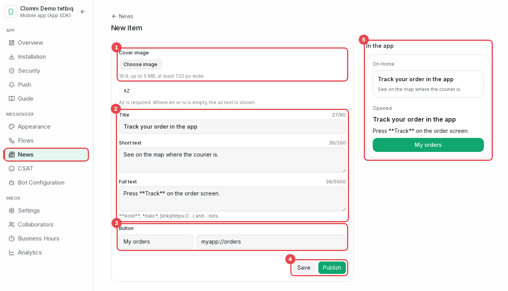

# Clomni paneli

Clomni'de her uygulama bir "Mobile app (App SDK)" gelen kutusudur. Bu bölümde gelen kutusu oluşturulur, ardından her
ayarın nerede olduğu gösterilir. Clomni hesabında Administrator rolüne sahip olmanız gerekir.

> Bu kılavuz panelde de var: gelen kutusu sayfası → ayarlar sütunu → **Guide**. Bkz. [Guide](#guide).

## Gelen kutusunu oluşturun

1. **Settings** (soldaki şeritte dişli simgesi) → **Workspace settings** → **Inboxes** → **Add Inbox** yolunu açın.
2. Kanal kataloğu açılır. **Mobile app (App SDK)** kartını bulun ve **Connect** düğmesine basın.

Sihirbazın altı adımı vardır. Yalnızca ilki zorunludur; diğerleri **Do it later** ile geçilip daha sonra gelen
kutusu sayfasında tamamlanabilir.

### 1. adım. Uygulama bilgileri

1. **Channel name**: temsilcilerinizin gelen kutusu listesinde gördüğü ad, örneğin "Example app".
2. **Platforms**: uygulamanızın çalıştığı platformları işaretleyin.
3. **Android package name**: `app/build.gradle(.kts)` dosyasındaki `applicationId`, örneğin `com.example.app`.
4. **iOS Bundle ID**: Xcode'daki uygulama hedefinin Bundle Identifier değeri (Signing & Capabilities).
5. **Create**. Gelen kutusu ve anahtarları o anda oluşturulur.

### 2. adım. Kurulum

Bu adımda **App ID** ve her platformun **API anahtarları**, yanlarında kopyalanmaya hazır kodla birlikte görünür.

> **API anahtarlarını şimdi kopyalayın.** Tam hâlleri yalnızca bu adımda gösterilir. Daha sonra panel yalnızca
> başlarını gösterir. Bir anahtar kaybolursa **Installation** bölümünde yenisini oluşturun (aşağıya bakın).

### 3. adım. Identity verification

Bu adımda **Identity Secret** görünür. Yalnızca bir kez gösterilir.

- Hemen sunucunuzda saklayın, örneğin `CLOMNI_IDENTITY_SECRET` ortam değişkeninde.
- Asla uygulamaya koymayın.
- Devam etmek için "I have stored the secret safely" kutusunu işaretleyin.
- Modu seçin. Şimdilik **Recommended** kalsın. Modlar [Kullanıcıların tanınması](02-identity.md) bölümünde
  anlatılıyor.

### 4. adım. Push bildirimleri

Firebase service account JSON dosyasını (Android) ve APNs `.p8` anahtarını (iOS) yükleyin ya da **Do it later**
düğmesine basın. Bu dosyaları nasıl alacağınız: [Push anahtarları](08-push-keys.md).

### 5. adım. Görünüm

Ana renk, logo, karşılama metni, tema ve yüzen düğme. Başlangıç değerleri web sitesi sohbetinizden alınır. Geri
kalan her şey **Appearance** bölümündedir.

### 6. adım. Akışlar

Kullanıcı yeni bir konuşma başlattığında çalışacak akışı seçin. Akış bu gelen kutusuna taslak olarak kopyalanır.
**Flows** bölümünde yayınlayın; aksi hâlde Messenger onu çalıştırmaz.

## Gelen kutusu sayfası

Gelen kutusunu daha sonra **Settings → Workspace settings → Inboxes** yolundan açın. Gelen kutusunun ayarları, panelin
kenar çubuğunun yanında ayrı bir sütundadır. Üstte gelen kutusunun adı yer alır; sağındaki **←** düğmesi gelen
kutuları listesine döner. Altında üç gruba ayrılmış bölümler bulunur. SDK için gerekenler:

| Grup | Bölüm | İçinde ne var |
|---|---|---|
| APP | Overview | Kanalın durumu, uyarılar, son görülen cihazlar |
| | Installation | App ID, API anahtarları, her platform için kod, son cihazlar |
| | Security | Identity verification modu, Identity Secret, hash test aracı |
| | Push | Firebase ve APNs anahtarları, bildirim başlığı, test push |
| | Guide | Bu kılavuzun PDF'i ve her platform için paket |
| MESSENGER | Appearance | Renkler, logo, metinler, diller, ana sayfa kartları, tema |
| | Flows | Bu gelen kutusunun akışları, neyle başladıklarına göre |
| | News | Messenger'ın ana sayfasındaki haberler |
| INBOX | Analytics | Aktif cihazlar, konuşmalar, push'lar, SDK sürümleri |

INBOX grubunda her gelen kutusunda bulunan ayarlar da yer alır: genel ayarlar, ekip üyeleri, çalışma saatleri.
Görüntülerde sütunun açık bölümü kırmızı bir çerçeveyle gösterilir. Dar ekranda sütun, sayfanın üstünde açılır bir
listeye dönüşür.

Flows ve News bölümlerinde **How does it look in the app?** bağlantısı vardır. SDK'nın gerçek ekranlarını bir
pencerede açar; müşterinin ne gördüğünü orada görürsünüz.

### Overview

Bir şey çalışmadığında ilk bakılacak yer. Her platform için SDK'nın bağlanıp bağlanmadığı ve push'un etkin olup
olmadığı görünür. Uyarılar (1) sorunu adıyla söyler, örneğin yanlış hash yüzünden reddedilen oturum açmalar. **Fix**
sorunun çözüldüğü bölümü açar.

### Installation: App ID ve API anahtarları

- **API keys** (1): **Copy** düğmesiyle App ID, ardından her platformun anahtarları. Anahtarın yalnızca başı görünür.
- **New key** (2) o platform için yeni bir anahtar oluşturur ve bir kez tam olarak gösterir.
  - Önceki anahtar **7 gün** daha çalışır. Bu sürenin sonunda eski anahtarı taşıyan uygulama sürümleri bağlanamaz.
  - Yeni anahtarı yalnızca eskisi sızdığında ya da kullanıcılarınızın çoğunun kuracağı bir sürümle birlikte
    oluşturun.
- **Revoke** anahtarı hemen durdurur. Sızmış bir anahtar için kullanın.

Aşağıdaki **Code** bloğunda Android, iOS, React Native ve Flutter için App ID'niz yazılmış hazır kod bulunur.

**Recent devices** son bağlanan cihazları uygulama ve SDK sürümüyle listeler. Uygulama `initialize` çağırıp bir
oturum açtıktan birkaç saniye sonra cihaz burada görünür.

### Security

1. **Mode**: Off, Recommended veya Enforced. Bkz. [Kullanıcıların tanınması](02-identity.md#modlar).
2. **Make a new secret**: yeni secret bir kez gösterilir. Eskisi 7 gün daha çalışır; sunucunuzu bu süre içinde yeni
   secret'a geçirin.
3. **Test a hash**: bir `user_id` ve sunucunuzun ürettiği `user_hash` değerini girin. Panel bunun güncel secret'a mı,
   eski secret'a mı uyduğunu, yoksa hiçbirine uymadığını söyler.

### Push

1. **Android · Firebase Cloud Messaging**: Firebase projesinin service account JSON dosyası.
2. **iOS · Apple Push Notification service**: Key ID, Team ID ve Bundle ID ile birlikte `.p8` anahtarı.

İkisini nasıl alıp yükleyeceğiniz: [Push anahtarları](08-push-keys.md).

Anahtarların altında:

- **Last 7 days**: gönderilen, başarısız olan, token'ı silinen (uygulama cihazdan kaldırılmış) ve atlanan (o
  platformun anahtarı yok) push'lar.
- **Notification title**: bildirimin ilk satırında ne yazacağı. Varsayılan "Temsilci · Marka".
- **Test push**: aşağıya bakın.

#### Test push

1. **Device**: push token'ı göndermiş cihazlardan birini seçin. Listede platform, model, uygulama sürümü ve APNs
   ortamı (sandbox veya production) yazar.
2. **Send**. Düğmenin altındaki yanıt doğrudan FCM'in veya APNs'in yanıtıdır. "Sent", bildirimin cihazda
   görünmesi gerektiği anlamına gelir.

Uygulama, bildirimlere izin verilmiş bir telefonda `setDeviceToken` çağırana kadar liste boştur.

### Appearance

Değişiklikler bir taslakta tutulur. Uygulamalar yalnızca yayınlanmış sürümü görür.

1. **Publish** taslağı uygulamalara gönderir. Açık Messenger'lar ekranda güncellenir; yeni bir uygulama sürümü
   gerekmez. Yanındaki **Versions** eski bir sürümü geri getirir.
2. **Main colour** ve Brand bölümündeki diğer ayarlar: ad, üst kısım, logo. Sağdaki önizleme her değişikliği
   anında gösterir.

**Languages** bölümü Messenger'ın hangi dillerde konuşacağını belirler. Uygulama `setLanguage` ile bunlardan birini
seçebilir; seçmezse Messenger telefonun diline uyar.

**Theme** bölümünde mod (1: telefona göre, açık, koyu), mesaj sesleri ve yüzen düğme (2), konumu ve alttan mesafesiyle
birlikte bulunur. Uygulamanın kodda verdiği değer (`setTheme`, `setLauncherVisible`) panelden önce gelir.

### Flows

Bu gelen kutusunun akışları, neyle başladıklarına göre gruplanmıştır:

- **When a conversation starts**: yeni bir konuşmayı karşılayan akış.
- **App event** (1): uygulamadan `startFlow` ile başlatılan akışlar. Her birinin yanında olayın adı, örneğin
  `Event: ride_problem`, ve onu gönderen kod bulunur.
- **By hand**: temsilcinin konuşmaya kendisinin gönderdiği akışlar.

**Open the builder** (2) Clomni'nin akış oluşturucusunu açar. Uygulama olayıyla başlayan bir akış için tetikleyici
olarak "App event" seçin, olayın adını yazın ve akışı yayınlayın.

**How does it look in the app?** (3) seçim düğmelerini ve formu SDK'da göründükleri gibi gösterir.

### News

Haberler Messenger'ın ana sayfasında görünür: yayınlanmış ilk üç haber. Sırayı değiştirmek için satırı sürükleyin.

1. **New item** yeni bir haberin düzenleyicisini açar.
2. **How does it look in the app?** haber kartlarını uygulamanın ana sayfasında gösterir.

Bir haberi değiştirmek için satırına tıklayın. Düzenleyici ayrı bir sayfada açılır. Başlığın üstündeki **← News**
listeye döner.

1. **Cover image**: 16:9, en fazla 5 MB, en az 720 px genişlik.
2. **Title** ve **Short text** ana sayfadaki kartta, **Full text** ise haber açıldığında görünür. Tam metinde
   `**bold**`, `*italic*`, bağlantı ve liste kullanılabilir. Alanların üstündeki dil düğmeleri düzenlediğiniz dili
   değiştirir. Azerbaycanca metin zorunludur; İngilizce veya Rusça boş kalırsa Azerbaycanca metin gösterilir.
3. **Button** (isteğe bağlı): metni ve bir web adresi ya da uygulamanızın bir deep link'i (platform bölümünüzde
   `onLink` kısmına bakın).
4. **Save** değişiklikleri kaydeder; yeni haber taslak olarak kalır. **Publish** haberi kaydedip uygulamalara
   gönderir. Yayınlanmış bir haberde bu düğme **Unpublish** olur.
5. **In the app**: ana sayfadaki kart ve açılmış haber, müşterinin gördüğü gibi. Her değişiklikle güncellenir.

### Guide

Bu kılavuz panelde de bulunur.

1. Kılavuzun PDF'i dört dilde: Azerbaycanca, İngilizce, Türkçe ve Rusça. Panelin dili ilk sırada gelir.
2. **Online guide language**: aşağıdaki bağlantılar kılavuzun bu dildeki bölümlerini açar.
3. **Online guide** platformunuzun bölümünü açar. Kartta paketin kurulum komutu vardır; **Copy** ile alın.
