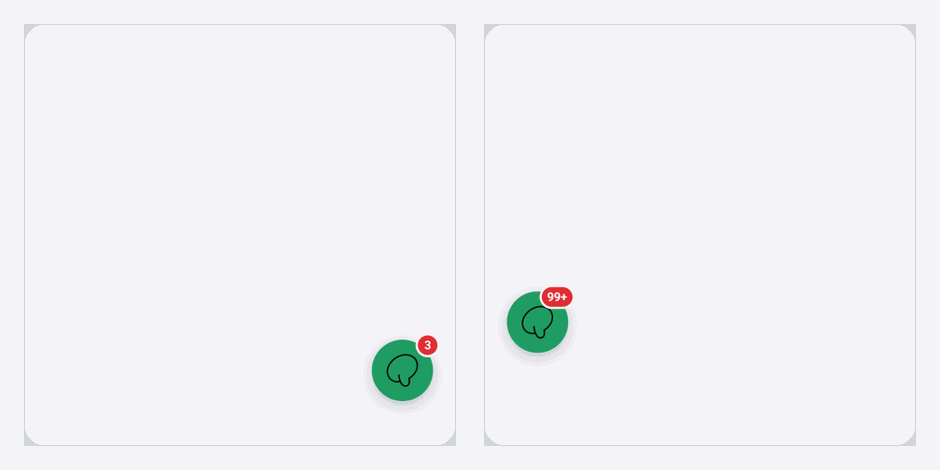
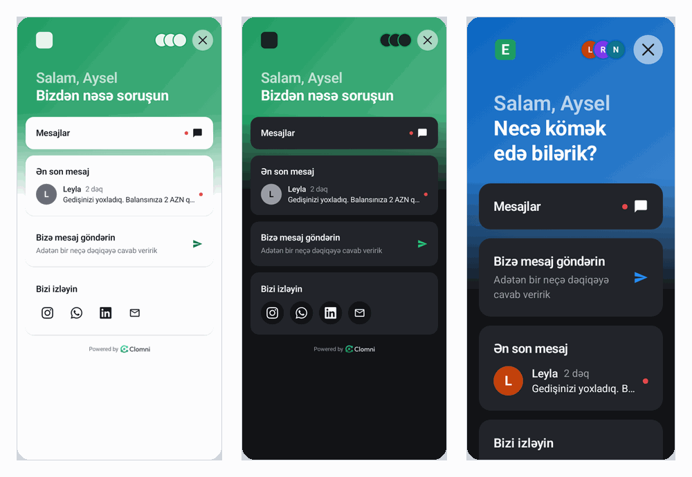

# Android

## Gereksinimler

- Android 6.0 (API 23) veya daha yenisi.
- `compileSdk` 35 veya daha yenisi.
- Kotlin 1.8 veya daha yenisi. Java da çalışır (bu bölümün sonuna bakın).
- Gelen kutusunun ayarlar sütununda **Installation** bölümünden App ID ve Android API anahtarı (`android_…`).

SDK 1.0.1, ağ erişimi dışında kendisi için hiçbir izin istemez ve ekranlarınıza hiçbir şey eklemez. 1.0.2'den itibaren
konuşmada kamerayla fotoğraf ve video çekmek ve sesli mesaj göndermek mümkündür:

- **Kamera** için izin gerekmez: SDK telefonun kendi kamera uygulamasını açar, FileProvider SDK'nın içindedir.
  Uygulamanın manifestinde `CAMERA` bildirilmişse SDK önce bu izni ister.
- **Sesli mesaj** için uygulama kendi `AndroidManifest.xml` dosyasında `RECORD_AUDIO` bildirmelidir. Bildirilmemişse
  mikrofon düğmesi görünmez ve SDK bunu loga yazar.

```xml
<uses-permission android:name="android.permission.RECORD_AUDIO" />
```

## Kurulum

Paket Maven Central'dadır. Çoğu projede `settings.gradle.kts` içinde `mavenCentral()` zaten bulunur.

```kotlin
// app/build.gradle.kts
dependencies {
    implementation("ai.clomni:messenger:1.0.1")
}
```

## Başlatma

`initialize`'ı bir kez, `Application` sınıfınızda çağırın. Bir bildirim uygulamanın sürecini başlatabilir ve
açtığı Messenger SDK'nın hazır olmasını bekler; bu yüzden bir `Activity` içinde çağırmak geç kalır.

```kotlin
// App.kt
import android.app.Application
import ai.clomni.messenger.Clomni
import ai.clomni.messenger.ClomniLogLevel

class App : Application() {
    override fun onCreate() {
        super.onCreate()
        Clomni.initialize(this, appId = "app_…", apiKey = "android_…")
        if (BuildConfig.DEBUG) Clomni.setLogLevel(ClomniLogLevel.DEBUG)
    }
}
```

```xml
<!-- AndroidManifest.xml -->
<application
    android:name=".App"
    ...>
```

AGP 8 ve sonrasında `BuildConfig.DEBUG` için `app/build.gradle.kts` içinde `buildFeatures { buildConfig = true }`
gerekir.

`Clomni`'nin tüm metotları herhangi bir thread'den çağrılabilir. Dinleyiciler ana thread'de çağrılır. İkinci bir
`initialize` çağrısı yok sayılır.

## Kullanıcı

Kendi oturum açma işleminizden sonra, sunucunuzdan gelen hash ile kullanıcıyı oturuma alın
([Kullanıcıların tanınması](02-identity.md)):

```kotlin
val user = ClomniUser(userId = "12345", email = "aysel@example.com", name = "Aysel Məmmədova")
Clomni.loginUser(user, userHash = hashFromYourServer)

Clomni.updateUser(language = "az", customAttributes = mapOf("plan" to "premium"))

// Uygulamanın kendi oturum kapatma işlemiyle birlikte:
Clomni.logout()
```

Kullanıcı oturum açmışsa, uygulama her açıldığında `loginUser`'ı yeni giriş yapmış gibi yeniden çağırın. Aynı kullanıcı
için SDK kayıtlı oturumunu kullanır.

## Messenger'ı açma

Kendi düğmenizden açın. `source`, uygulamanın neresinden açıldığını belirtir.

```kotlin
findViewById<View>(R.id.support).setOnClickListener {
    Clomni.present(source = "profile_support")
}
```

Jetpack Compose'da:

```kotlin
Button(onClick = { Clomni.present(source = "profile_support") }) {
    Text("Destek")
}
```

Açmanın ve kapatmanın diğer yolları:

| Çağrı | Ne yapar |
|---|---|
| `Clomni.present(source)` | Ana sayfayı açar |
| `Clomni.presentNewConversation(source)` | Doğrudan yeni bir konuşma açar |
| `Clomni.presentConversation(id)` | Bilinen bir konuşmayı açar; ID `onConversationStarted`'dan gelir |
| `Clomni.dismiss()` | Messenger'ı koddan kapatır |

### Okunmamış sayısı

Okunmamış yanıtların sayısını düğmenizin yanında gösterin. Dinleyici güncel sayıyı hemen, sonra her değişikliği
alır.

```kotlin
class ProfileActivity : AppCompatActivity() {
    private val unread = UnreadCountListener { count ->
        supportBadge.isVisible = count > 0
        supportBadge.text = count.toString()
    }

    override fun onStart() {
        super.onStart()
        Clomni.addUnreadCountListener(unread)
    }

    override fun onStop() {
        Clomni.removeUnreadCountListener(unread)
        super.onStop()
    }
}
```

### Yüzen düğme (isteğe bağlı)



Yüzen düğme varsayılan olarak kapalıdır. Panel onu açabilir (Appearance → Theme); kodda verilen değer önceliklidir.
`setBottomPadding` düğmeyi alttaki gezinme çubuğunun üstüne kaldırır, dp cinsinden.

```kotlin
Clomni.setLauncherVisible(true)
Clomni.setBottomPadding(72)
```

## Uygulamanın başlattığı akışlar

Ekranlarınızdan birindeki bir düğme belirli bir konuda konuşma başlatabilir, örneğin bir yolculukla ilgili sorun.
Panelde "App event" tetikleyicisi ve `ride_problem` olay adıyla bir akış kurup yayınlayın. Uygulamada:

```kotlin
Clomni.startFlow(
    "ride_problem",
    mapOf("ride_id" to "R-1923"),
    openMessenger = true,
    source = "ride_screen",
)
```

- Akışın metinleri veriyi `{{data.ride_id}}` biçiminde kullanabilir. Veri JSON değerlerinden oluşmalıdır: dizeler,
  sayılar, boolean'lar, listeler ve map'ler.
- Olaya bağlı yayınlanmış bir akış yoksa hiçbir şey olmaz.
- Kullanıcının dokunmadığı bir olay için (örneğin başarısız bir ödeme) `openMessenger = false` bırakın. Kullanıcı
  konuşmadan bir push'la ya da okunmamış sayısından haberdar olur.

**Olay adı akışın adı değildir.** `startFlow`'a paneldeki Flows bölümünde akışın altındaki "Event: …" satırındaki adı
verin. Akış "App event" tetikleyicisiyle kurulmalıdır: "When a conversation starts" tetikleyicili bir akış `startFlow`
ile başlamaz.

## Olaylar

```kotlin
Clomni.onMessengerOpened { source -> Log.d("App", "opened from $source") }
Clomni.onMessengerClosed { Log.d("App", "closed") }
Clomni.onConversationStarted { id -> Log.d("App", "conversation $id") }
Clomni.onFlowCompleted { flowId -> Log.d("App", "flow $flowId completed") }
Clomni.onUnreadCountChanged { count -> Log.d("App", "unread $count") }
```

Her olayın tek bir dinleyicisi vardır. Yenisini atamak eskisinin yerine geçer; `null` dinleyiciyi kaldırır.

## Bağlantılar

Bir haberin düğmesi bir web adresi veya uygulamanızın deep link'ini taşıyabilir. `onLink` ile bağlantı önce
uygulamanıza gelir. Uygulama açtıysa `true` döndürün; `false` ya da dinleyici olmaması sistemin açmasına bırakır.

```kotlin
Clomni.onLink { url ->
    if (url.startsWith("example://")) {
        startActivity(Intent(Intent.ACTION_VIEW, Uri.parse(url)).setPackage(packageName))
        true
    } else {
        false
    }
}
```

## Dil, sesler ve görünüm

```kotlin
Clomni.setLanguage("en")          // az, en veya ru; null telefona uyar
Clomni.setSoundsEnabled(false)    // panel ne derse desin kapalı
```

- **Dil.** Messenger panelde açılmış dilleri konuşur (Appearance → Languages). `setLanguage` bunlardan birini seçer.
  `null` ya da kapalı bir dil telefonun diline, ardından panelin ana diline uyar.
- **Sesler.** Bir konuşma açıkken gönderilen ve gelen mesaj için kısa bir ses. Telefonun sessiz moduna uyar.

Renkler, logo ve metinler panelden gelir. Bunların üzerine uygulamanızın kendi rengini, yazı tipini ve modunu koymak
için `setTheme` kullanın. Renk `#RRGGBB` biçimindedir; diğer marka renkleri ondan türetilir. Her çağrı öncekinin
yerine geçer; verilmeyen değer panelinki olarak kalır.

```kotlin
Clomni.setTheme(
    primaryColor = "#0A66C2",
    typeface = ResourcesCompat.getFont(context, R.font.montserrat),
    mode = ClomniThemeMode.DARK,      // LIGHT, DARK veya SYSTEM
)
```



Yalnızca yazı tipi için: `Clomni.setTypeface(typeface)`. Yazı tipi yine de kullanıcının metin boyutu ayarına uyar.

## Push bildirimleri

Temsilcilerin yanıtları kapalı bir uygulamaya Firebase Cloud Messaging (FCM) data mesajları olarak ulaşır. SDK'nın
Firebase bağımlılığı yoktur: uygulamanız kendi `firebase-messaging` kütüphanesini tutar ve Clomni'ye token'ı ve
mesajları verir. Kendi push'larınız size ait kalır.

Gerekenler:

1. Android uygulamanızın eklendiği bir Firebase projesi ve uygulamadaki `google-services.json` dosyası.
2. Projenin panele yüklenmiş service account JSON dosyası ([Push anahtarları](08-push-keys.md)).
3. Aşağıdaki kod.

### 1. Uygulamada Firebase

[Firebase console](https://console.firebase.google.com)'da projenizi açın (ya da yeni bir proje oluşturun) ve paket
adınızla bir Android uygulaması ekleyin.

> **Yol:** `Firebase console → projeniz → Project Overview → + Add app → Android`
>
> **Android package name** alanına uygulamanızın paket adını girin (örneğin `com.example.app`) ve **Register app**
> düğmesine basın.
>
> Belgeler: [firebase.google.com/docs/android/setup](https://firebase.google.com/docs/android/setup#register-app)

`google-services.json` dosyasını indirip projenizin `app/` klasörüne koyun.

> **Yol:** `Firebase: Download google-services.json → Android Studio: <proje>/app/google-services.json`
>
> Dosyayı Android Studio'da görmek için Project penceresinin üstündeki menüden **Project** görünümünü seçin.
>
> Belgeler: [firebase.google.com/docs/android/setup](https://firebase.google.com/docs/android/setup#add-config-file), [developer.android.com/studio/projects](https://developer.android.com/studio/projects#ProjectView)

```kotlin
// settings.gradle.kts (veya kök build.gradle.kts)
plugins {
    id("com.google.gms.google-services") version "4.4.2" apply false
}
```

```kotlin
// app/build.gradle.kts
plugins {
    id("com.android.application")
    id("org.jetbrains.kotlin.android")
    id("com.google.gms.google-services")
}

dependencies {
    implementation("ai.clomni:messenger:1.0.1")
    implementation(platform("com.google.firebase:firebase-bom:33.4.0"))
    implementation("com.google.firebase:firebase-messaging")
}
```

> `google-services.json` uygulama içindir. Panel başka bir dosya ister: **service account JSON**. Bkz.
> [Push anahtarları](08-push-keys.md).

### 2. Token'ı ve mesajları iletme

```kotlin
// AppMessagingService.kt
import ai.clomni.messenger.Clomni
import ai.clomni.messenger.ClomniPush
import com.google.firebase.messaging.FirebaseMessagingService
import com.google.firebase.messaging.RemoteMessage

class AppMessagingService : FirebaseMessagingService() {
    override fun onNewToken(token: String) {
        Clomni.setDeviceToken(token)
        // uygulamanın kendi push'ları varsa kendi sunucunuza da
    }

    override fun onMessageReceived(message: RemoteMessage) {
        if (ClomniPush.handle(this, message.data)) return
        // uygulamanın kendi push'u
    }
}
```

```xml
<!-- AndroidManifest.xml, <application> içinde -->
<service
    android:name=".AppMessagingService"
    android:exported="false">
    <intent-filter>
        <action android:name="com.google.firebase.MESSAGING_EVENT" />
    </intent-filter>
</service>
```

FCM, `onNewToken`'ı yalnızca token değiştiğinde çağırır. Güncel token'ı her açılışta da iletin,
`Application.onCreate` içinde `initialize`'dan sonra:

```kotlin
FirebaseMessaging.getInstance().token.addOnSuccessListener(Clomni::setDeviceToken)
```

Token, o an oturum açmış kişi için kaydedilir; sonraki `loginUser` veya `logout`'tan sonra yeniden kaydedilir.
`ClomniPush.isClomniPush(data)`, bir Clomni push'unu işlemeden sizin push'larınızdan ayırt eder.

### 3. Android 13 ve sonrasında izin

Bildirimler `POST_NOTIFICATIONS` iznini gerektirir. SDK bu izni hiçbir zaman istemez. İzni bildirin ve
kullanıcılarınız için anlamlı bir anda isteyin, örneğin ilk mesajlarından sonra:

```xml
<!-- AndroidManifest.xml -->
<uses-permission android:name="android.permission.POST_NOTIFICATIONS" />
```

```kotlin
class MainActivity : AppCompatActivity() {
    private val askNotifications = registerForActivityResult(ActivityResultContracts.RequestPermission()) { }

    private fun askForNotifications() {
        if (Build.VERSION.SDK_INT >= 33 &&
            ContextCompat.checkSelfPermission(this, Manifest.permission.POST_NOTIFICATIONS) !=
            PackageManager.PERMISSION_GRANTED
        ) {
            askNotifications.launch(Manifest.permission.POST_NOTIFICATIONS)
        }
    }
}
```

İzin yoksa hiçbir şey gösterilmez, ancak okunmamış sayısı güncel kalır.

### Kullanıcı ne görür

- Her konuşma için bir bildirim. Başlık temsilci ve markadır ("Leyla · Example"), metin mesajın kendisidir (180
  karaktere kadar) ve temsilcinin fotoğrafı gösterilir. Aynı konuşmadan gelen daha yeni bir mesaj onun yerini alır.
- Bildirim kanalı `clomni_messages`'tır (`ClomniPush.CHANNEL_ID`); Messenger'ın dilinde "Support messages" olarak
  adlandırılır ve önem düzeyi yüksektir. İlk bildirim gösterildiğinde oluşturulur. Kullanıcılar onu sistem
  ayarlarından kapatabilir.
- Bildirime dokunmak uygulamanızın başlangıç ekranını açar; Messenger o konuşmayla ekranın üzerinde açılır.
- Messenger açıkken Clomni bildirimleri gösterilmez: mesajı Messenger kendisi gösterir.

Küçük simge, uygulamanızın simgesidir. Android onu siluet olarak çizer; uygulama simgeniz beyaz değilse SDK'ya beyaz
bir simge verin:

```kotlin
Clomni.setNotificationIcon(R.drawable.ic_notification)
```

### Test etme

1. Uygulamayı bir telefonda çalıştırın, bildirimlere izin verin ve Messenger'ı bir kez açın.
2. Panelde: ayarlar sütununda **Push** → **Test push** → cihazı seçin → **Send**.

Sunucu olmadan bir Clomni bildirimini görmek için `ClomniPush.handle`'a kendiniz bir map verin:

```kotlin
ClomniPush.handle(context, mapOf(
    "clomni" to "1", "type" to "message", "conversation_id" to "conv_1",
    "title" to "Leyla · Example", "body" to "Yolculuğunuzu kontrol ettik.", "unread_total" to "1",
))
```

## Java

Tüm çağrılar Java'dan da çalışır:

```java
Clomni.initialize(context, "app_…", "android_…");
Clomni.loginUser(new ClomniUser("12345", "aysel@example.com"), hashFromYourServer);
Clomni.present("profile_support");
Clomni.onLink(url -> false);
```

## Sorunlar

| Belirti | Ne yapmalı |
|---|---|
| logcat'te `call Clomni.initialize first` | `initialize`'ı `Application.onCreate` içinde çağırın ve sınıfı manifest'te `android:name` ile belirtin |
| `api_key səhvdir və ya bu platforma üçün deyil` | Anahtar yanlış, iptal edilmiş ya da iOS anahtarı. `android_…` anahtarını kullanın |
| Bildirim yok, logcat'te `notification not shown (POST_NOTIFICATIONS?)` | Android 13+ üzerinde `POST_NOTIFICATIONS` iznini isteyin |
| `push token not registered: …` | `setDeviceToken` çağrılarını ve paneldeki service account JSON dosyasını kontrol edin |
| Bildirimler geliyor ama simge gri bir kare | `setNotificationIcon` ile beyaz siluet bir simge verin |
| Servisinizin `onMessageReceived` metodu hiç çağrılmıyor | Servis manifest'te yok ya da uygulamadaki başka bir `FirebaseMessagingService` mesajları alıyor. Bir uygulamada yalnızca bir tane olur: Clomni mesajlarını o servisten iletin |

Daha fazlası: [Sorun giderme](09-troubleshooting.md). Loglar logcat'te `Clomni` etiketi altındadır.
